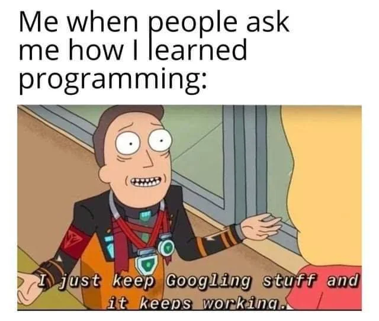

# Introduction

## Aim of the class

At the end of this class, you will:

- Be familiar with the Python environment
- Understand the basics of coding with Python (type of data structures, how to manipulate them)
- Create simple functions
- Upload, modify and download your own files into Python 

## Requirements

You need to have a computer, and either:

- [install Python 3.0.0](https://www.Python.org/downloads/) (or above) and install a text editor (Word is not a text editor!). 

::: {.callout-note} 
An IDE (integrated development environment) is an improved text editor. It is a software that provides functionalities like syntax highlighting, auto completion, help, debugger… 
I recommand Visual Studio Code ([install](https://code.visualstudio.com/Download/) and learn [how to use it with Python](https://code.visualstudio.com/docs/languages/Python)), but [any other IDE](https://en.wikipedia.org/wiki/Comparison_of_integrated_development_environments#Python) will work.
::: 

- have a github account, [create a new codespace](https://github.com/codespaces/), and select the Repository `vgilbart/Python-intro` to copy from. This is a free solution up to 60 hours of computing and 15 GB per month. 


## What is Python? 

Python is a programming language first released in 1991 and implemented by Guido van Rossum. 

::: {.column-margin}
{#fig-GuidovanRossum width=100%}
:::


It is widely used, with various applications, such as:

- software development
- web development
- data analysis
- ...

It supports different types of programming paradigms (~ way of thinking) including the procedural programming paradigm. 
In this approach, the program moves through a linear series of instructions.

```{python}
# Create a string seq
seq = 'ATGAAGGGTCC'
# Call the function len() to retrieve the length of the string
size = len(seq)
# Call the function print() to print a text
print('The sequence has', size, 'bases.')
```


## Why use Python? 

- Easy-to-use and easy-to-read syntax
- Large standard library for many applications (`numpy` for tables/matrices, `matplotlib` for graphs, `scikit-learn` for machine learning...)
- Interactive mode making it easy to test short snippets of code
- Large community ([stackoverflow](https://stackoverflow.com/questions/tagged/Python))

::: {.column-margin}
{#fig-googling width=100%}
:::


## How can I program in Python? 

Python is an interpreted language, this means that all scripts written in Python need a software to be run. This software is called an interpreter, which "translate" the each line of the code, into instructions that the computer can understand. 
By extension, the interpreter that is able to read Python scripts is also called Python.
So, whenever you want your Python code to run, you give it to the Python interpreter. 

### Interactive mode 

One way to to launch the Python interpreter is to type

```{bash}
python3
```

on the command line of a terminal. 

::: {.callout-note} 
You can also try `python`, `/usr/bin/env python3`, `/usr/bin/python3`... There are many ways to call python!

You can see where your current python is located by running `which python3`. 
:::

From this, you can start using python interactively, e.g. run: 

```{python}
print("Hello world")
```

To get out of the Python interpreter, type `quit()`or `exit()`. Alternatively, on Linux/Mac press `[ctrl + d]`, on Windows press `[ctrl + z]` followed by `enter`. 

### Script mode 

To run a script, create a folder named `script`, in which a file named `class1.py` contains: 

```{python }
#| eval: FALSE
#!/usr/bin/env python3
# -*- coding: UTF-8 -*-

print("Hello world")
```

and run 
```{bash}
./script/class1.py
```

You should get the same output as before, that is:

```{python}
#| echo: FALSE
print("Hello world")
```

The shebang `#!` followed by the interpreter `/usr/bin/env python3` can be put at the beginning of the script in order to ommit calling `python3` in command-line. If you don't put it, you will have to run `python3 script/class1.py` instead of simply `./script/class1.py`.

The `-*- coding: UTF-8 -*-` specify the type of encoding to use. UTF-8 is used by default (which means that this line in the script is not necessary). This accepts characters from all languages. Other valid [encoding](https://docs.python.org/3/library/codecs.html#module-codecs) are available, such as ascii (English characters only). 

::: {.callout-warning} 
Some common errors can occur at this step: 

- `bash: ./script/class1.py: No such file or directory` i.e. you are not in the right directory to run the file.

  Solution: run `ls */` and make sure you can find `script/: class1.py`, if not go to the correct directory by running `cd <insert directory name here>`
- `bash: ./script/class1.py: Permission denied` i.e. you don't have the right to execute your script.
  
  Solution: run `ls -l script/class1.py` and make sure you have at least `-rwx` (read, write, exectute rights) as the first 4 characters, if not run `chmod 744 ./script/class1.py` to change your rights.
:::

# Basic concepts 

## Values and variables 

You will manipulate values such as integers, characters or dictionaries. These values can be stored in memory using variables. To assign a value to a variable, use the `=` operator as follow: 

```{python}
seq = 'ATGAAGGGTCC'
```

To output the variable value, either type the variable name or use a function like `print()`:
```{python}
seq 
```
```{python}
print(seq)
```

We can change a variable value by assigning it a new one:
```{python}
seq = seq + 'AAAA' # The + operator can be used to concatenate strings
seq
```

A variable can have a short name (like x and y) or a more descriptive name (seq, motif, genome_file). Rules for Python variable names:

- must start with a letter or the underscore character
- cannot start with a number
- can only contain alpha-numeric characters and underscores (A-z, 0-9, and _ ), NO SPACE
- are case-sensitive (seq, Seq and SAQ are three different variables)
- cannot be any of the Python keywords (run `help('keywords')` to find the list of keywords).

::: {.callout-important title="Exercise"} 
Are the following variables names legal?

- `2_sequences`
- `_sequence`
- `seq-2`


::: {.callout .content-visible when-meta="solutions" collapse="true" title="Solutions"}

- No (starts with a number)
- Yes
- No (contains a `-`)

:::

:::

## Function calls

A function stores a piece of code that performs a certain task, and that gets run when called. It takes some data as input (parameters that are required or optional), and returns an output (that can be of any type). Some functions are predefined (but we will also learn how to create our own later on).

To run a function, write its name followed by parenthesis. Parameters are added inside the parenthesis as follow:

```{python}
# round(number, ndigits=None)
x = round(number = 5.76543, ndigits = 2)
print(x)
```

Here the function `round()` needs as input a numerical value. As an option, one can add the number of decimal places to be used with digits. If an option is not provided, a default value is given. In the case of the option ndigits, `None` is the default. The function returns a numerical value, that corresponds to the rounded value. This value, just like any other, can be stored in a variable.

To get more information about a function, use the `help()` function.


::: {.callout-note} 
If you provide the parameters in the exact same order as they are defined, you don’t have to name them. If you name the parameters you can switch their order. As good practice, put all required parameters first.

```{python}
round(5.76543, 2) 
```

```{python}
round(ndigits = 2, number = 5.76543) 
```
:::


Here are (@tbl-function-useful) some basic but useful R functions:

| Function  | Description  |
|--------|--------|
| `print()`  | Print into the screen the values given in argument.   |
| `help()`   | Execute the built-in help system  |
| `quit()` or `exit()` | Exit from Python |
| `len()` | Return the length of an object |
| `round()` | Round a numbers |

: List of useful Python functions. {#tbl-function-useful}


## Getting help

To get more information about a function or an operator, you can use the `help()` function. For example, in interactive mode, run `help(print)` to display the help of the `print()` function, giving you information about the input and output of this function. 
If you need information about an operator, you will have to put it into quotes, e.g. `help('+')`

::: {.callout-tip} 
## Browse the help

If the help is long, press `[enter]` to get the next line or `[space]` to get the next 'page' of information.  
To quit the help, press `q`. 
:::


## Comment your code 

Except for the shebang and coding specifications seen before, all things after a hashtag `#` character will be ignored by the interpreter until the end of the line.
This is used to add comments in your code. 

Comments are used to:

- explain assumptions
- justify decisions in the code
- expose the problem being solved
- ...

# How can I represent data? 

Variables can stores data of different types, here are a few useful ones: 

| Type  | Description  |
|--------|--------|
| Text | `str` |
| Numeric | `int`, `float`, `complex` |
| Sequence | `list`, `tuple` |
| Mapping | `dict` |
| Boolean | `bool` |
| None | `NoneType` |

You can get the data type of any object by using `type()`.

## Boolean

Booleans represent one of two values: `True` or `False`.

When you compare two values, the expression is evaluated and Python returns the Boolean answer:

```{python}
print(10 > 9)
```

## Numeric

Python provides three kinds of numerical type: 

* `int` ($\mathbb{Z}$) 
* `float` ($\mathbb{R}$) 
* `complex` ($\mathbb{C}$)

Python will assign a numerical type automatically. 

```{python}
x = 1    
y = 2.8 
z = 1j   
```

```{python}
type(x)
```

```{python}
type(y)
```

```{python}
type(z)
```

## Text 

String type represents textual data composed of letters, numbers, and symbols. The character string must be expressed between quotes.

```{python}
#| eval: FALSE
"""my string"""
'''my string'''
"my string"
'my string'
```

are all the same thing. The difference with triple quotes is that it allows a string to extend over multiple lines. You can also use single quotes and double quotes freely within the triple quotes.


```{python}
# A multi-line string
my_str = '''This is a multi-line string. This is the first line.
This is the second line.
"What's your name?," I asked.
He said "Bond, James Bond."
'''

print(my_str)
```

You can get the number of characters inside a string with `len()`.
```{python}
len(seq)
```

Strings have specific methods (~ functions). Here are a few: 

| Method  | Description  |
|--------|--------|
| `count()` | Returns the number of times a specified value occurs in a string|
| `startswith()` | Returns true if the string starts with the specified value| 
| `endswith()` | Returns true if the string ends with the specified value | 
| `find()` | Searches the string for a specified value and returns the position of where it was found | 
| `replace()` | Returns a string where a specified value is replaced with a specified value | 

They are called like this: 

```{python}
seq.count('A')
```

::: {.callout-tip} 
To get the `help()` of the `count()` method, you need to run `help(str.count)`.
:::

::: {.callout-important title="Exercise"} 
1. Check if the sequence `seq` starts with the codon `ATG`
2. Replace all `T` into `U` in `seq`

::: {.callout .content-visible when-meta="solutions" collapse="true" title="Solutions"}

1. 
```{python}
seq.startswith('ATG')
```
2. 
```{python}
seq.replace('T', 'U')
```

:::
:::


## List

List is a collection which is ordered and changeable. It allows duplicate members. 
They are created using square brackets `[]`.

```{python}
seq = ['ATGAAGGGTCCAAAA', 'AGTCCCCGTATGAT', 'ACCT', 'ACCT']
```

List items are indexed, the first item has index `[0]`, the second item has index `[1]` etc. 

```{python}
seq[1]
```

::: {.callout-tip} 
You can also count backwards, with the index `[-1]` that retrieves the last item.
:::

As a list is changeable, we can change, add, and remove items in a list after it has been created. 

```{python}
seq[1] = 'ATG'
seq
```


You can specify a range of indexes by specifying the start (included) and the end (not included) of the range. 

```{python}
seq[0:2]
```

::: {.callout-tip} 
By leaving out the start value, the range will start at the first item:
```{python}
seq[:2]
```
Similarly, by leaving out the end value, the range will end at the last item.
:::

You can get how many items are in a list with `len()`.
```{python}
len(seq)
```

Lists have specific methods. Here are a few: 

| Method  | Description  |
|--------|--------|
| `append()` | Inserts an item at the end |
| `insert()` | Inserts an item at the specified index | 
| `extend()` | Append elements from another list to the current list | 
| `remove()` | Removes the first occurance of a specified item | 
| `pop()` | Removes the specified (by default last) index | `
| `sort()` | Sorts the list alphanumerically, by default in ascending order |
| `count()` | Returns the number of times a specified value occurs  |
| `index()` | Searches for a specified value and returns the position of where it was found |

::: {.callout-important title="Exercise"} 
1. Create a list `l = ['AAA', 'AAT', 'AAC']`, and add `AAG` at the end. 
2. Replace all `T` into `U` in the element `AAT`

::: {.callout .content-visible when-meta="solutions" collapse="true" title="Solutions"}

1. 
```{python}
l = ['AAA', 'AAT', 'AAC']
l.append('AAG') 
# Note that you don't need to assign 
# l = l.append('AAA') to update l
l
```
2. 
```{python}
l[1] = l[1].replace('T', 'U')
l
# or also, l[1] = 'AAU'
```

:::
:::


## Tuples
Tuple is a collection which is ordered and unchangeable. It allows duplicate members.
Tuples are written with round brackets `()`.

```{python}
seq = ('ATGAAGGGTCCAAAA', 'AGTCCCCGTATGAT', 'ACCT', 'ACCT')
```

Just like for the list, you can get items with their index. The only difference is that you cannot change a tuple that has been created. 

Lists have specific methods. Here are a few: 

| Method  | Description  |
|--------|--------|
| `count()` | Returns the number of times a specified value occurs  |
| `index()` | Searches for a specified value and returns the position of where it was found |

## Set 

Set is a collection which is unordered and unindexed. It does not allow duplicate members (they will be ignored).
Sets are written with curly brackets `{}`.

```{python}
seq = {'ATGAAGGGTCCAAAA', 'AGTCCCCGTATGAT', 'ACCT', 'ACCT'}
```

Once a set is created, you cannot change its items (as they don't have index), but you can remove and add items.


Sets have specific methods. Here are a few: 

| Method  | Description  |
|--------|--------|
| `add()` | Adds an element to the set |
| `difference()` | 	Returns a set containing the difference between two sets | 
| `intersection()` | 	Returns a set containing the intersection between two sets | 
| `union()` | 	Returns a set containing the union of two sets | 
| `remove()` | Remove the specified item | 
| `pop()` | Removes a random element | 

## Dictionary

Dictionaries are used to store data values in key:value pairs.
A dictionary is a collection which is ordered (as of Python >= 3.7), changeable and does not allow duplicates keys.
Dictionaries are written with curly brackets `{}`, with keys and values.

```{python}
codon = {
  "A": "AAA",
  "B": "AAT",
  "C": "AAG",
}
```

Dictionary items can be referred to by using the key name.
```{python}
codon["B"]
```

Dictionaries have specific methods. Here are a few: 

| Method  | Description  |
|--------|--------|
| `items()` |	Returns a list containing a tuple for each key value pair | 
| `keys()` | Returns a list containing the dictionary's keys |
| `values()` | Returns a list of all the values in the dictionary |
| `pop()` | Removes the element with the specified key |
| `get()` | Returns the value of the specified key |


::: {.callout-important title="Exercise"} 

Get the value of the key `B`. If the key does not exist, return `ATG` by default. 
Try your code with the dictionary `codon`, before and after removing the `B` key:value pair.

::: {.callout .content-visible when-meta="solutions" collapse="true" title="Solutions"} 
```{python}
#| eval: FALSE
codon.get('B', 'ATG')
codon.pop('B')
codon.get('B', 'ATG')
```
::: 
:::


# How can I manipulate data?

## Operators 

## Conditionals

## Iterations

::: {.callout-important title="Exercise"} 

1. 

::: {.callout .content-visible when-meta="solutions" collapse="true" title="Solutions"}
1. 
::: 
:::

# References {.unnumbered}
https://docs.python.org/3/tutorial/introduction.html
https://www.w3schools.com/python/
https://colab.research.google.com/drive/1oGIybNPgqUH8_tavy-yloW55YoSZZsVx?usp=sharing#scrollTo=qHPTgwHWPMn2
https://github.com/vgilbart/Rintro/blob/main/01_IntroductionToR.Rmd
https://www.pythonforbiologists.org/
https://docs.python.org/
https://justinbois.github.io/bootcamp/2020/lessons/l01_welcome.html#.py-files 