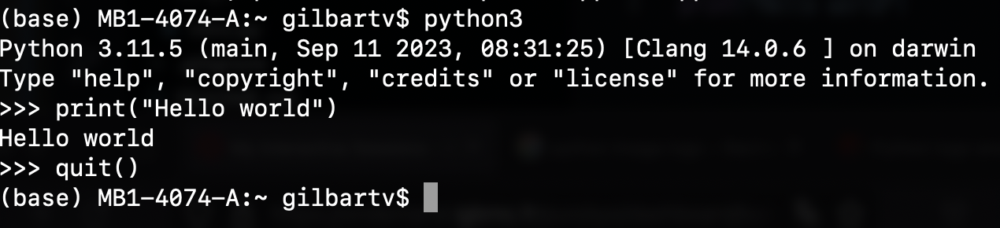
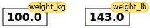
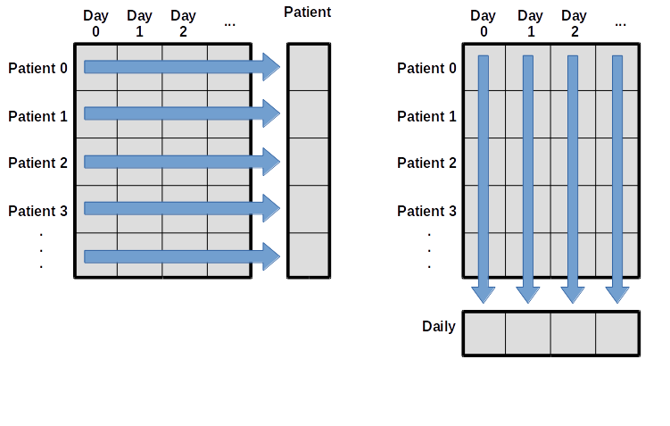
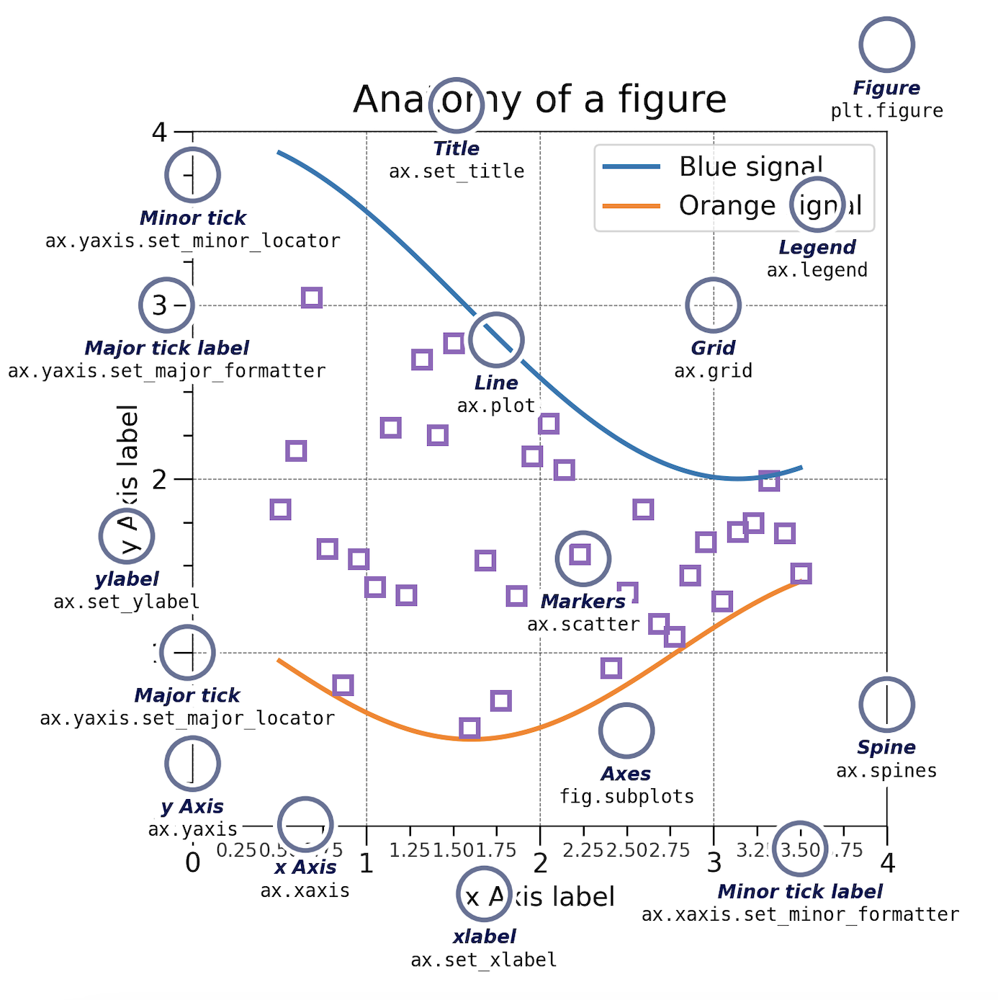
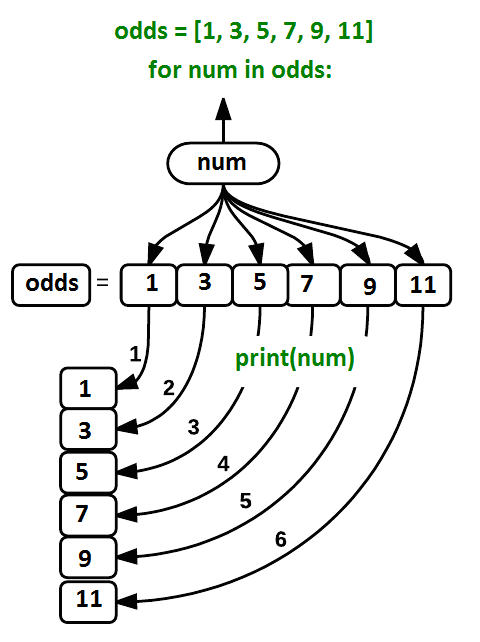

# Introduction

## Aim of the class

At the end of this class, you will:

- Be familiar with the Python environment
- Understand some major data types in Python 
- Manipulate variables with built-in functions
- Manipulate data from a file
- Visualize data from a file
- Create loops


## What is Python? 

Python is a programming language first released in 1991 and implemented by Guido van Rossum. 

It is widely used, with various applications, such as:

- software development
- web development
- data analysis
- ...

It supports different types of programming paradigms (i.e. way of thinking) including the procedural programming paradigm. 
In this approach, the program moves through a linear series of instructions.

```{python}
# Create a string seq
seq = 'ATGAAGGGTCC'
# Call the function len() to retrieve the length of the string
size = len(seq)
# Call the function print() to print a text
print('The sequence has', size, 'bases.')
```


## Why use Python? 

- Easy-to-use and easy-to-read syntax
- Large standard library for many applications (`pandas` for tables, `matplotlib` for graphs, `scikit-learn` for machine learning...)
- Interactive mode making it easy to test short snippets of code
- Large community ([stackoverflow](https://stackoverflow.com/questions/tagged/Python))


## How can I program in Python? 

Python is an interpreted language, this means that it is not directly compiled into machine code (binary instructions that the computer hardware understands). It is executed by an interpreter program that "translates" each line of the code, into instructions that the computer can understand. 
By extension, the interpreter that is able to read Python scripts is also called Python.
So, whenever you want your Python code to run, you must call the Python interpreter. 

### Interactive mode 

One way to launch the Python interpreter is to type the following, on the command line of a terminal:

```{bash}
python3
```


::: {.callout-note} 
You can also try `python`, `/usr/bin/env python3`, `/usr/bin/python3`... There are many ways to call python!

You can see where your current python is located by running `which python3`. 
:::

From this, you can start using python interactively, e.g. run: 

```{python}
print("Hello world")
```

To get out of the Python interpreter, type `quit()`or `exit()`, followed by `enter`. Alternatively, on Linux/Mac press `[ctrl + d]`, on Windows press `[ctrl + z]`. 


{#fig-interactive width=100%}


### Script mode 

To run a script, create a folder named `script`, in which a file named `intro.py` contains: 

```{python}
#| eval: FALSE
#!/usr/bin/env python3
# -*- coding: UTF-8 -*-

print("Hello world")
```

and run 
```{bash}
./script/intro.py
```

You should get the same output as before, that is:

```{python}
#| echo: FALSE
print("Hello world")
```

The shebang `#!` followed by the interpreter `/usr/bin/env python3` can be put at the beginning of the script in order to ommit calling `python3` in command-line. If you don't put it, you will have to run `python3 script/intro.py` instead of simply `./script/intro.py`.

The `-*- coding: UTF-8 -*-` specify the type of encoding to use. UTF-8 is used by default (which means that this line in the script is not necessary). This accepts characters from all languages. Other valid [encoding](https://docs.python.org/3/library/codecs.html#module-codecs) are available, such as ascii (English characters only). 

::: {.callout-warning} 
Some common errors can occur at this step: 

- `bash: script/intro.py: No such file or directory` i.e. you are not in the right directory to run the file.

  Solution: run `ls */` and make sure you can find `script/: intro.py`, if not go to the correct directory by running `cd <insert directory name here>`, e.g. `cd ~/Desktop/swc-python` (`~` is a shortcut for your home directory)
- `bash: script/intro.py: Permission denied` i.e. you don't have the right to execute your script.
  
  Solution: run `ls -l script/intro.py` and make sure you have at least `-rwx` (read, write, exectute rights) as the first 4 characters, if not run `chmod 744 script/intro.py` to change your rights.
:::

# Basic concepts 

## Values and variables 

Any Python interpreter can be used as a calculator:

```{python}
3 + 5 * 4
```

This is great but not very interesting.
To do anything useful with data, we need to assign its value to a *variable*.
In Python, we can assign a value to a variable, using the equals sign `=`.
For example, we can track the weight of a patient who weighs 60 kilograms by
assigning the value `65` to a variable `weight_kg`:

```{python}
weight_kg = 65
```

{#fig-interactive width=70%}


From now on, whenever we use `weight_kg`, Python will substitute the value we assigned to
it. In plain language terms, **a variable is a name for a value**.

A variable can have a short name (like x and y) or a more descriptive name (seq, motif, genome_file). Rules for Python variable names:

- must start with a letter or the underscore character and cannot start with a number
- can only contain alpha-numeric characters and underscores (A-z, 0-9, and _ )
- are case-sensitive (seq, Seq and SEQ are three different variables)
- cannot be any of the Python keywords (run `help('keywords')` to find the list of keywords).

This means that, for example:

- `€or$` is not a valid variable name
- `weight0` is a valid variable name, whereas `0weight` is not
- `weight`, `Weight` and `WEIGHT`, are different variables
- `keywords` are different variables

::: {.callout-important title="Exercise"} 
I want to store the weight of patient 2 in a variable. 
Are the following variables names legal?

- `2_weight_kg`
- `_weight_kg`
- `weight_kg-2`
- `weight_kg 2`

You can try to assign a value to these variable names to be sure of your answer! 
:::

::: {.content-hidden unless-meta="solutions"}

::: {.callout collapse="true" title="Solutions"}


```{python}
#| error: true
2_weight_kg = 70 # No (starts with a number)
```
```{python}
#| error: true
_weight_kg = 70 # Yes, this is accepted!
```
```{python}
#| error: true
weight_kg-2 = 70 # No (contains a dash)
```
```{python}
#| error: true
weight_kg 2 = 70 # No (contains a space)
```

:::

:::

Python knows various types of data. Three common ones are:

* `int` ($\mathbb{Z}$), integers
* `float` ($\mathbb{R}$), real numbers
* `str`, strings or more commonly known as characters

Python will assign a type automatically. 

In the example above, variable `weight_kg` has an integer value of `60`.
If we want to more precisely track the weight of our patient,
we can use a floating point value by executing:

```{python}
weight_kg = 60.3
```

To create a string, we add single or double quotes around some text.
To identify and track a patient throughout our study,
we can assign each person a unique identifier by storing it in a string:

```{python}
patient_id = '001'
```

Once we have data stored with variable names, we can make use of it in calculations.
We may want to store our patient's weight in pounds as well as kilograms:

```{python}
weight_kg = 65.0
weight_lb = 2.2 * weight_kg
```

{#fig-interactive width=100%}
The expression `2.2 * weight_kg` is evaluated to `143.0`, and then this value is assigned to the variable `weight_lb` (i.e. the sticky noteweight_lbis placed on `143.0`). At this point, each variable is "stuck" to completely distinct and unrelated values.

::: {.callout-warning} 
The value of `weight_lb` is computed, in the moment of assigning the value, from the current value of `weight_kg`. Modifying `weight_kg` later on will not modify the value of `weight_lb` indirectly (i.e. `weight_lb` is not recomputed every time it is called, its value stays the same)

```{python}
print(weight_lb)

weight_kg = 100

print(weight_kg, weight_lb)
```


{#fig-interactive width=100%}

Since `weight_lb` doesn’t 'remember' where its value comes from, it is not updated when we change `weight_kg`.

::: 

To carry out common tasks with data and variables in Python,
the language provides us with several built-in functions.
To display information to the screen, we use the `print` function:

```{python}
print(weight_lb)
print(patient_id)
```

We just used a function (also known as calling a function)... But what is a function exactly? 

## Function calls

A function stores a piece of code that performs a certain task, and that gets run when called. It usually takes some data as input (parameters that are required or optional), and usually returns an output (that can be of any type). Some functions are predefined, like `print()` that prints values, or `len()` that calculates the length of a variable. We will also learn how to create our own later on.

.](img/function.png){#fig-interactive width=100%}

To run a function, write its name followed by parentheses. Parameters are added inside the parentheses as follow:

```{python}
print(patient_id)
len(patient_id)
```

We can display multiple things at once using only one `print()` call:

```{python}
print(patient_id, 'weight in kilograms:', weight_kg)
```

We can also call a function inside of another function call.
For example, Python has a built-in function called `round()` that rounds a value:

```{python}
print(patient_id, 'weight in kilograms:', round(weight_kg))
```

Moreover, we can do arithmetic with variables right inside the `print` function:

```{python}
print('weight in pounds:', 2.2 * weight_kg)
```

The above command, however, did not change the value of `weight_kg`:

```{python}
print(weight_kg)
```

To change the value of the `weight_kg` variable, we have to
**assign** `weight_kg` a new value using the equals `=` sign:

```{python}
weight_kg = 65.0
print('weight in kilograms is now:', weight_kg)
```

To get more information about a function, use the `help()` function. 

Let's see the help for the `round()` function:

```{python}
help(round)
```

Here the function `round()` needs as input `number` a numerical value. 
As an option, one can add `ndigits` the number of decimal places to be used with digits. 
If an option is not provided, a default value is given. In the case of the option `ndigits`, `0` is the default. The function returns a numerical value (more specifically a floating point number), that corresponds to the rounded value. This value, just like any other, can be stored in a variable.

```{python}
rounded_weight_kg = round(weight_kg)
print(rounded_weight_kg)
```

::: {.callout-note} 
If you provide the parameters in the exact same order as they are defined, you don’t have to name them. If you name the parameters you can switch their order. As good practice, put all required parameters first.

```{python}
round(5.76543, 2) 
```

```{python}
round(ndigits = 2, number = 5.76543) 
```
:::


In @tbl-function-useful you will find some basic but useful python functions:

| Function  | Description  |
|--------|--------|
| `print()`  | Print into the screen the values given in argument.   |
| `help()`   | Execute the built-in help system  |
| `quit()` or `exit()` | Exit from Python |
| `len()` | Return the length of an object |
| `round()` | Round a numbers |

: List of useful Python functions. {#tbl-function-useful}


## Getting help

To get more information about a function or an operator, you can use the `help()` function. For example, in interactive mode, run `help(print)` to display the help of the `print()` function, giving you information about the input and output of this function. 
If you need information about an operator, you will have to put it into quotes, e.g. `help('+')`

::: {.callout-tip} 
## Browse the help

If the help is long, press `[enter]` to get the next line or `[space]` to get the next 'page' of information.  
To quit the help, press `q`. 
:::

Every built-in function has extensive [documentation that can also be found online](https://docs.python.org/3/library/index.html).
You can also search the internet when having issues. 
Paste the last line of your error message or the word "python" and a short description of what you want to do into your favorite search engine and you will usually find several examples where other people have encountered the same problem and came looking for help.

- [StackOverflow](https://stackoverflow.com/questions) can be particularly helpful for this: answers to questions are presented as a ranked thread ordered according to how useful other users found them to be
- Ask somebody “in the real world”. If you have a colleague or friend with more expertise in Python than you have, show them the problem you are having and ask them for help
- generative AI chatbots
    
::: {.callout-warning}
Copying and pasting code (from a human or a AI chatbot) is risky unless you understand exactly what it is doing!
:::

::: {.callout-warning} 
You will probably receive some useful guidance by presenting your error message to the chatbot and asking it what went wrong. However, the way this help is provided by the chatbot is different. Answers on StackOverflow have (probably) been given by a human as a direct response to the question asked. But generative AI chatbots, which are based on an advanced statistical model, respond by generating the most likely sequence of text that would follow the prompt they are given.

While responses from generative AI tools can often be helpful, they are not always reliable. These tools sometimes generate plausible but incorrect or misleading information, so (just as with an answer found on the internet) it is essential to verify their accuracy. You need the knowledge and skills to be able to understand these responses, to judge whether or not they are accurate, and to fix any errors in the code it offers you.
::: 

::: {.callout-note} 
In addition to asking for help, programmers can use generative AI tools to generate code from scratch; extend, improve and reorganise existing code; translate code between programming languages; figure out what terms to use in a search of the internet; and more. However, there are drawbacks that you should be aware of:

- The models used by these tools have been “trained” on very large volumes of data, much of it taken from the internet, and the responses they produce reflect that training data, and may recapitulate its inaccuracies or biases.
- The environmental costs (energy and water use) of LLMs are a lot higher than other technologies, both during development (known as training) and when an individual user uses one (also called inference). For more information see the [AI Environmental Impact Primer](https://huggingface.co/blog/sasha/ai-environment-primer) developed by researchers at HuggingFace, an AI hosting platform.
- Concerns also exist about the way the data for this training was obtained, with questions raised about whether the people developing the LLMs had permission to use it.
- Other ethical concerns have also been raised, such as reports that workers were exploited during the training process.

::: 

::: {.callout-tip} 

Remember that for this lesson:

- For most problems you will encounter at this stage, help and answers can be found among the first results returned by searching the internet.
- The fundamental knowledge and skills you will learn in this lesson by writing and fixing your own programs are essential to be able to evaluate the correctness and safety of any code you receive from online help or a generative AI chatbot. If you choose to use these tools in the future, the expertise you gain from learning and practicing these fundamentals on your own will help you use them more effectively.
- As you start out with programming, the mistakes you make will be the kinds that have also been made – and overcome! – by everybody else who learned to program before you. Since these mistakes and the questions you are likely to have at this stage are common, they are also better represented than other, more specialised problems and tasks in the data that was used to train generative AI tools. This means that a generative AI chatbot is more likely to produce accurate responses to questions that novices ask, which could give you a false impression of how reliable they will be when you are ready to do things that are more advanced.

::: 

::: {.callout-important title="Exercise"} 

Read the help of the `print()` function. Print several variables (e.g `print(weight_kg, weight_lb)`). Using one of the parameters, add a separator in between each value. 

:::

::: {.content-hidden unless-meta="solutions"}

::: {.callout collapse="true" title="Solutions"}

```{python}
help(print)
```

```{python}
print(weight_kg, weight_lb, sep = ', ')
```

:::

:::

## Comment your code 

Except for the shebang and coding specifications seen before (e.g. inside a string, defined but quotes `'` or `"`), all things after a hashtag `#` character will be ignored by the interpreter until the end of the line. This is used to add comments in your code.

Comments are used to:

- explain assumptions
- justify decisions in the code
- expose the problem being solved
- inactivate a line to help debug
- ...

This line is not evaluated:

```{python}
# print("Hello world")
```

This line is evaluated:

```{python}
print("Hello world")
```

This line is evaluated up until the #:

```{python}
print("Hello world") # This is a comment, it is ignored by the interpreter
```

This line is fully evaluated:

```{python}
print("Hello world, # This is not a comment although there is a hashtag!")
```

# Exploring the dataset
## Importing a python package

Basic built-in functions are useful, but what is even more useful is the possibility to use functions that other people have written, and that are available in Python packages (you might also encounter the terms library or module, we will use them equivalently in this course).

A python package contains a set of function to perform specific tasks.

There are built-in packages that come with Python, and there are also third-party packages that you can install and use. For scientific computing, the most commonly used packages are third-party packages like `numpy` for numerical computing, `pandas` for data manipulation and analysis, matplotlib for data visualization, and `scikit-learn` for machine learning.

A package needs to be **installed** to your computer one time. But **loaded** in your script every time you want to use it.

::: {.callout-warning} 
Installing a package is done outside of the python interpreter, in command line in a terminal.
::: 

You can install a package with `pip`. It should have been automatically installed with your python, to make sure that you have it you can run:
```{bash}
# In Linux/MacOS
python -m pip --version
# In Windows
py -m pip --version
```
If it does not work, check out pip documentation

To install a package called pandas, you must run:
```{bash}
# In Linux/MacOS
python -m pip install pandas
# In Windows
py -m pip install pandas
```
To get more information about pip, check out the full documentation.

When you wish to use a package in a python script, you’ll need to import it, by writing inside of you script:

```{python}
import pandas
```

::: {.callout-tip} 
Importing a library is like getting a piece of lab equipment out of a storage locker and setting it up on the bench. Libraries provide additional functionality to the basic Python package, much like a new piece of equipment adds functionality to a lab space.
:::

## Loading the patient file 

Pandas is a package used to work with data sets, in order to easily clean, manipulate, explore and analyze data. Once we’ve imported the library, we can ask the library to read our data file for us:
```{python}
# Make sure this is the correct path for you! You are in the directory from where you execute the script.
pandas.read_csv('data/inflammation-01.csv', index_col=0)
```


The expression `pandas.read_csv()` is a function call that asks Python to run the function `read_csv()` which belongs to the pandas library.

::: {.callout-note} 
The dot notation in Python is used most of all as an object attribute/property specifier or for invoking its function. `object.property` will give you the value of `property` from `object`, while `object.function()` will invoke on object function.
:::

We used `pandas.read_csv()` with two parameter:

- the name of the file we want to read. This parameter needs to be a character string, so we put it in quotes.
- `index_col`, an optional parameter that specifies the column number to use as the row names.

Since we haven’t told it to do anything else with the function’s output, it displays it. To save the data in memory, we need to assign it to a variable:

```{python}
data = pandas.read_csv('data/inflammation-01.csv', index_col=0)
```

This statement doesn’t produce any output because we’ve assigned the output to the variable data. If we want to check that the data have been loaded, we can print the variable’s value (to not print everything, we will use `.head()` method):

```{python}
print(data.head(5))
```

::: {.callout-note} 
A method is a function that is associated with an object. It is called on the object and can access and modify the object’s data. In Python, methods are defined within classes and are accessed using dot notation.

For example, if you have a pandas object called `data`, you can call the `head()` method on it to display the first few rows of the data by writing `data.head()`. The `head()` method is a built-in method of pandas DataFrame objects that returns the first n rows of the DataFrame, where n is specified as an argument (default is 5).

To access the help of such a method, you can use `help(pandas.DataFrame.head)`, where pandas is the library, DataFrame is the class of the object, and head is the method you want to learn about.

Methods are a fundamental part of another programming paradigm in Python called object-oriented programming, and allow you to perform operations on objects in a convenient and organized way.
:::

## Notes on types, attributes and methods

In Python, data can be of different types, and the type of data determines what operations can be performed on it. For example, the + operator on two numbers will add them mathematically, but on two strings it will concatenate them.

There is a function in Python to determine the type of a value or variable, it is called `type()`.
```{python}
print(type(65))
print(type(65.0))
print(type("Hello world"))

print(type(weight_kg))

print(type(round))
```

Let’s see what is the type of the data we loaded with pandas:

```{python}
print(type(data))
```

It is called a DataFrame. A DataFrame is a two-dimensional data structure with labeled axes. It is one of the most commonly used data structures in the pandas library for data manipulation and analysis. It can be thought of as what we generally call a table with rows and columns. Each column can contain different types of data (e.g., integers, floats, strings) and each row represents a record or an observation.

It is actually composed of a pandas data type called Series. A Series is a one-dimensional array-like object that can hold any data type (integers, floats, strings, etc.). It is similar to a column in a table. Each element in a Series has an associated index, which allows for easy access and manipulation of the data. A DataFrame is essentially a collection of Series objects that share the same index.

We can access one column of the data with `data.iloc[0]` (the first column has index 0, the second column has index 1, etc.) and check its type:

```{python}
print(data.iloc[0].head(5))
print(type(data.iloc[0]))
```


Notice that the output of `print(data.iloc[0].head(5))` also gives two information: `Name:0, dtype: int64`. `Name:0` indicates the name of the Series, which is 0 in this case (since we didn’t specify column names when loading the data, pandas automatically assigns integer names to the columns starting from 0). `dtype: int64` indicates the data type of the values in the Series, which is int64, meaning that the values are 64-bit integers.

We could get these same information by running:

```{python}
print(data.iloc[0].name)
print(type(data.iloc[0].dtype))
```

There are also the index (the rownames) on the left of the output, that are not part of the data but are generated by pandas to help us access the data. The index could be also accessed like so:

```{python}
print(data.iloc[0].index)
print(type(data.iloc[0].index))
```

::: {.callout-note} 

Notice that .index and .dtype are attributes of the Series, not methods, since they are not called with parentheses (). An attribute is a value associated with an object, while a method is a function that is associated with an object and can be called to perform an action on that object. In this case, .index and .dtype are attributes that provide information about the Series, while methods like .head() perform actions on the Series.

::: 

](img/attribute_and_method.jpeg){#fig-interactive width=100%}

## Describing the dataset

There are many useful methods and attributes in pandas that helps describe a DataFrame.

For example, to get the number of rows and the number of colmuns of the DataFrame:

```{python}
print(data.shape) # rows x columns i.e. patients x days
```

You get access to the index and column names with:

```{python}
print(data.columns) # days
print(data.index) # patients
```

To explore the data set, use the following methods:

```{python}
print(data.info()) 
```

The `.info()` method tells us that our data set has 60 rows (patients) and 40 columns (days), that there are no missing values (`60 non-null`), and that all the values are integers (`int64`).

```{python}
print(data.describe()) 
```

The `.describe()` method gives us some basic statistics about the data column-wise (i.e. day-wise), such as the mean, standard deviation, minimum and maximum values, and the quartiles.

From the mean, we can already see that at the number of inflammation flare-ups increases over time, to then decrease back close to 0.

## Slicing data

If we want to get a single number from the DataFrame, we must provide an index in square brackets after the variable name, just as we do in math when referring to an element of a matrix. Our inflammation data has two dimensions, so we will need to use two indices to refer to one specific value:

```{python}
print('first value in data:', data.iloc[0, 0])
print('middle value in data:', data.iloc[29, 19])
```

The expression `data.iloc[29, 19]` accesses the element at row 30, column 20. While this expression may not surprise you, `data.iloc[0, 0]` might.


::: {.callout-note} 

Programming languages like R start counting at 1 because that’s what human beings do. Languages like Python count from 0 because it is closer to the way that computers represent arrays (if you are interested in the historical reasons behind counting indices from zero, you can read Mike Hoye’s blog post).

As a result, if we have an MxN array in Python, its indices go from 0 to M-1 on the first axis and 0 to N-1 on the second. It takes a bit of getting used to, but one way to remember the rule is that the index is how many steps we have to take from the start to get the item we want.

{#fig-interactive width=100%}

:::

`.iloc[29, 19]` selects a single element of an array, but we can select whole sections as well. For example, we can select the first ten days (columns) of values for the first four patients (rows) like this:

```{python}
print(data.iloc[0:4, 0:10])
```

The slice 0:4 means, “Start at index 0 and go up to, but not including, index 4”. Again, the up-to-but-not-including takes a bit of getting used to, but the rule is that the difference between the upper and lower bounds is the number of values in the slice.

We don’t have to start slices at 0:

```{python}
print(data.iloc[5:10, 0:10])
```

We also don’t have to include the upper and lower bound on the slice. If we don’t include the lower bound, Python uses 0 by default; if we don’t include the upper, the slice runs to the end of the axis, and if we don’t include either (i.e., if we use `:` on its own), the slice includes everything:

```{python}
small = data.iloc[:3, 36:]
print('small is:')
print(small)
```


It is also possible to use negative index, `-1` will retrieve the last item, `-2` the second last item, etc. For example, to get the value last 10 patient on the 1st day, you could use:

```{python}
print(data.iloc[40:-1, 0])
```

::: {.callout-tip} 
One way to remember how slices work is to think of the indices as pointing between characters, with the left edge of the first character numbered 0. Then the right edge of the last character of a string of n characters has index n, for example:

```{bash}
  +---+---+---+---+---+---+
  | P | y | t | h | o | n |
  +---+---+---+---+---+---+
  0   1   2   3   4   5   6
 -6  -5  -4  -3  -2  -1
```

The first row of numbers gives the position of the indices 0…6 in the string; the second row gives the corresponding negative indices. The slice from i to j consists of all characters between the edges labeled i and j, respectively.
:::

## Analysing data 

Pandas has several useful functions that take an array as input to perform operations on its values. If we want to find the average inflammation for all patients across days, for example, we can run:

```{python}
print(data.mean())
```

If we cant to find the average inflammation for all days across patients, we can run:

```{python}
print(data.mean(axis=1))
```

`axis` is an optional parameter of the method `.mean()` that specifies if the mean should be calculated column-wise (i.e. day-wise, `axis=0`) or row-wise (i.e. patient-wise, `axis=1`). Same goes with `.median()`:

```{python}
print(data.median())
```

We can also get the max, min across days or patients with `data.max()` and `data.min()`, and the standard deviation with `data.std()`.

```{python}
print(data.max(axis=0))
print(data.max(axis=1))
print(data.min())
print(data.std())
```

{#fig-interactive width=100%}


::: {.callout-tip} 
If you are interested in learning more about functions available in a package, you can check out the its documentation. Pandas is very famous and has a extensive documentation, for example you could check out the ["Getting started tutorials"](https://pandas.pydata.org/docs/getting_started/intro_tutorials/06_calculate_statistics.html).
:::

## Exercise

TODO They have tried another drug, and we want to compare the inflammation levels of patients treated with the new drug to those treated with the old drug. We have a second data file inflammation-02.csv that contains the inflammation levels of patients treated with the new drug.

# Visualizing data
## Matplotlib package

A good way to develop insight is often to visualize data. We can explore a few features of Python’s matplotlib library here. While there is no official plotting library, `matplotlib` is one of the standard packages to create visualizations in Python and is widely used in science.

::: {.callout-note} 
As for any package, we need to install it one on our computer to then be able to import it in our script and use its functions.

Remember that installing a package is done outside of the python interpreter, in command line in a terminal.

```{bash}
# In Linux/MacOS
python -m pip install matplotlib
# In Windows
py -m pip install matplotlib
```
::: 

To shorten the name of the package when we call its functions, we can import it with a nickname, as follows:

```{python}
import pandas as pd

data = pd.read_csv('data/inflammation-01.csv', index_col=0)
```

For matplotlib, we usually import like so:

```{python}
import matplotlib.pyplot as plt
```

`pyplot` is one of the modules of `matplotlib`. It contains functions to generate basic plots. We can display a heatmap of our data:

```{python}
image = plt.imshow(data)
plt.show()
```

Each row in the heat map corresponds to a patient in the clinical trial dataset, and each column corresponds to a day in the dataset. Blue pixels in this heat map represent low values, while yellow pixels represent high values. As we can see, the general number of inflammation flare-ups for the patients rises and falls over a 40-day period. So far so good as this is in line with our knowledge of the clinical trial.

## Function or object-oriented

This first way of plotting is function-oriented. It relies on pyplot to implicitly create and manage the Figures and Axes, and use pyplot functions for plotting.

```{python}
image = plt.imshow(data)
plt.show()
```

There is a second way of plotting called object-oriented. It needs to explicitly create Figures and Axes, and call methods on them (the “object-oriented (OO) style”).


```{python}
fig = plt.figure()
ax = fig.add_subplot(1, 1, 1)

ax.imshow(data)

fig.tight_layout()
plt.show()
```

You might encounter both styles of coding.

`fig` refers to the overall figure — the entire canvas that holds everything, including one or more plots. `ax` is the specific subplot (axes) where your data is drawn. In simple plots, we often interact only with `ax` to label axes or plot data. However, `fig` becomes useful when you want to set the overall figure title, adjust layout, or save the figure to a file.

The function `plt.figure()` creates a space into which we will place all of our plots. 
Each subplot is placed into the figure using its add_subplot method. The add_subplot method takes 3 parameters. The first `nrows` denotes how many total rows of subplots there are, the second parameter `ncols` refers to the total number of subplot columns, and the final parameter `index` denotes which subplot your variable is referencing (left-to-right, top-to-bottom). 

::: {.callout-note} 
Notice that the names of the functions/methods called are not the same: the function `xlabel()` is used for the function-oriented manner and the method `set_xlabel()` is used for the object-oriented.
:::

## Matplotlib anatomy 

Matplotlib graphs your data on Figures, each of which can contain one or more Axes. An Axes is an area where points can be specified in terms of x-y coordinates. 

Axes contains a region for plotting data and includes generally two Axis objects (2D plots), a title, an x-label, and a y-label. The Axes methods (e.g. `.set_xlabel()`) are the primary interface for configuring most parts of your plot (adding data, controlling axis scales and limits, adding labels etc.).

An Axis sets the scale and limits and generate ticks (the marks on the Axis) and ticklabels (strings labeling the ticks). 

::: {.callout-note} 
Be aware of the difference between Axes and Axis.
:::



There are many other plot available: `.plot()`, `.scatter()`, `.bar()`, `.hist()`, `.pie()`, `.boxplot()`...

Let’s take a look at the average inflammation over time:

```{python}
#| fig-width: 8
#| fig-height: 8
ave_inflammation = data.mean(axis=0)

fig = plt.figure()
ax = fig.add_subplot(1, 1, 1)

ax.plot(ave_inflammation)

fig.tight_layout()
plt.show()
```

The x-axis of this plot represents the days of the clinical trial, while the y-axis represents the average inflammation level across all patients for each day. The plot shows a clear pattern of increasing inflammation levels over the first 20 days, followed by a decrease in inflammation levels over the remaining 20 days. This pattern is consistent with what we observed in the heat map and with our knowledge of the clinical trial.

Since our column names are `Day 1`, `Day 2`, etc., the x-axis of the plot is labeled with these column names. If we want to label the x-axis with the actual day numbers (1, 2, 3, etc.), we can modify the code as follows:

```{python}
#| fig-width: 8
#| fig-height: 8

import numpy as np

ave_inflammation = data.mean(axis=0)

fig = plt.figure()
ax = fig.add_subplot(1, 1, 1)

ax.plot(ave_inflammation)
ax.set_xlabel('Days')
ax.set_ylabel('Average Inflammation')
ax.set_xticks(np.arange(start=0, stop=40, step=5))

plt.show()

```

::: {.callout-note} 
For this solution we needed to import the numpy package, which is a fundamental package for scientific computing in Python. It provides support for arrays, matrices, and a large collection of mathematical functions to operate on these data structures.
::: 

Here, `np.arange()` is a function from the numpy package that generates an array of evenly spaced values within a specified range. In this case, `np.arange(start=0, stop=40, step=5)` generates an array of values starting from 0 up to (but not including) 40, with a step of 5. This means it will generate the values `[0, 5, 10, 15, 20, 25, 30, 35]`.

`ax.set_xticks()` expects a list of positions on the x-axis where the ticks should be placed. By passing the array generated by `np.arange()`, we are specifying that we want ticks at those positions (`0, 5, 10, 15, 20, 25, 30, 35`) on the x-axis of our plot. This allows us to label the x-axis with the actual day numbers corresponding to our data.

We also modified the labels of the x and y axes with `ax.set_xlabel()` and `ax.set_ylabel()` to make the plot more informative.

## Grouping plots 

You can group similar plots in a single figure using subplots. 
The parameter `figsize` tells Python how big to make this space. Each subplot is placed into the figure using `fig.add_subplot()`, which takes 3 parameters `nrows`, `ncols` and `index`. 
Each subplot is stored in a different variable (`axes1`, `axes2`, `axes3`). Once a subplot is created, the axes can be titled using the `ax.set_xlabel()` command (or `ax.set_ylabel()`). Here are our three plots side by side:


```{python}
import matplotlib.pyplot as plt
import pandas as pd

data = pd.read_csv('data/inflammation-01.csv', index_col=0)

fig = plt.figure(figsize=(10.0, 3.0))

axes1 = fig.add_subplot(1, 2, 1)
axes2 = fig.add_subplot(1, 2, 2)

axes1.set_xlabel('Days')
axes1.set_ylabel('Patient')
axes1.imshow(data)

ave_inflammation = data.mean(axis=0)
axes2.set_xlabel('Days')
axes2.set_ylabel('Average Inflammation')
axes2.plot(ave_inflammation)
axes2.set_xticks(np.arange(start=0, stop=40, step=5))

fig.tight_layout()

plt.show()
```

## Save a figure


You can save a figure with the `fig.savefig()` method, which takes as input the name of the file you want to save the figure to. The file will be saved in the current working directory, so make sure to provide the correct path if you want to save it somewhere else.
```{python}
fig.savefig('data/figure.png')
```


::: {.callout-note} 
One could also run:

```{python}
plt.savefig('data/figure.png')
```

The `matplotlib.pyplot` module works by automatically referencing the current active figure (i.e., the most recently created or interacted-with figure).

But be careful, after a figure has been displayed to the screen (e.g. with `plt.show()`) matplotlib will make this variable refer to a new empty figure. Therefore, make sure you call `plt.savefig()` before the plot is displayed to the screen, otherwise you may find a file with an empty plot. 
:::  

The plot can also be save as ps, pdf or svg. Moreover, the resolution can be modified.
See the documentation of [`.savefig()`](https://matplotlib.org/stable/api/_as_gen/matplotlib.pyplot.savefig.html) for more parameters.


## Matplotlib documentation 

For more information, check out the following ressources: 

- the [documentation](https://matplotlib.org/stable/users/explain/quick_start.html)
- the [cheat sheet](https://matplotlib.org/cheatsheets/)
- any [useful tutorial](https://www.w3schools.com/python/matplotlib_intro.asp)
- some [inspiration](https://matplotlib.org/stable/gallery/index)

## Exercise

::: {.callout-important title="Exercise"} 

1. Create a figure with two subplots... on top of one another instead of side by side.

:::

::: {.content-hidden unless-meta="solutions"}

::: {.callout collapse="true" title="Solutions"}

1. 

:::
:::


# Storing multiple values in lists 

We were provided with 9 more trial data, and we want to load and explore it as well.

Our goal now is to process all the inflammation data we have, which means that we still have eleven more files to go!

The natural first step is to collect the names of all the files that we have to process. In Python, a list is a way to store multiple values together. In this episode, we will learn how to store multiple values in a list as well as how to work with lists.

## Creating a list

Data structures are a collection of data types (e.g. numerical, characters) and/or data structures, organized in some way.
Lists are one of the data structures in Python. 
A list is a collection which is ordered and changeable. It allows duplicate members. They are created using square brackets `[]`.

We create a list by putting values inside square brackets and separating the values with commas:

```{python}
odds = ['one', 3, 5, 7]
print('odds are:', odds)
```

::: {.callout-note} 
Notice that lists can contain elements of different types, here strings and integers. 
:::

We can access elements of a list using indices, i.e. numbered positions of elements in the list. The first item has index `[0]`, the second item has index `[1]` etc.

```{python}
print('first element:', odds[0])
print('last element:', odds[3])
print('"-1" element:', odds[-1])
```

::: {.callout-tip} 
You can count backwards, with the index `[-1]` that retrieves the last item, `[-2]` the second to last, and so on. Because of this, `odds[3]` and `odds[-1]` point to the same element here.
:::

Subsets of lists and strings can be accessed by specifying ranges of values in brackets, similar to how we accessed ranges of positions in a pandas DataFrame. This is commonly referred to as "slicing" the list/string.

```{python}
binomial_name = 'Drosophila melanogaster'
group = binomial_name[0:10]
print('group:', group)

species = binomial_name[11:23]
print('species:', species)

chromosomes = ['X', 'Y', '2', '3', '4']
autosomes = chromosomes[2:5]
print('autosomes:', autosomes)
```


::: {.callout-tip} 
By leaving out the start value, the range will start at the first item:

```{python}
chromosomes[:2]
```

Similarly, by leaving out the end value, the range will end at the last item.

```{python}
chromosomes[2:]
```
:::


::: {.callout-note} 
Remember, one way to recall how slices work is to think of the indices as pointing between characters, with the left edge of the first character numbered 0. Then the right edge of the last character of a string of n characters has index n, for example:

```{base}
  +---+---+---+---+---+---+
  | P | y | t | h | o | n |
  +---+---+---+---+---+---+
  0   1   2   3   4   5   6
 -6  -5  -4  -3  -2  -1
```

The first row of numbers gives the position of the indices 0…6 in the string; the second row gives the corresponding negative indices. The slice from i to j consists of all characters between the edges labeled i and j, respectively.
:::

You can get how many items are in a list with `len()`.

```{python}
len(chromosomes)
```


## Lists are mutable

There is one important difference between lists and strings: we can change the values in a list, but we cannot change individual characters in a string. For example:

```{python}
names = ['Curie', 'Darwing', 'Turing']  # typo in Darwin's name
print('names is originally:', names)
names[1] = 'Darwin'  # correct the name
print('final value of names:', names)
```

works, but:

```{python}
#| error: true
name = 'Darwin'
name[0] = 'd'
```

does not.


Data which can be modified in place is called mutable, while data which cannot be modified is called immutable. Strings and numbers are immutable. This does not mean that variables with string or number values are constants, but when we want to change the value of a string or number variable, we can only replace the old value with a completely new value.

Lists and pandas DataFrame, on the other hand, are mutable: we can modify them after they have been created. We can change individual elements, append new elements, or reorder the whole list. For some operations, like sorting, we can choose whether to use a function that modifies the data in-place or a function that returns a modified copy and leaves the original unchanged.

Be careful when modifying data in-place. If two variables refer to the same list, and you modify the list value, it will change for both variables!

```{python}
seq = ['ATGAAGGGTCCAAAA', 'AGTCCCCGTATGAT', 'ACCT', 'ACCT']
seq_mutated = seq # <-- seq and seq_mutated point to the *same* list data in memory
seq_mutated[-1] = 'AGGT'
print('sequences in seq:', seq)
print('sequences in seq_mutated:', seq_mutated)
```

If you want variables with mutable values to be independent, you must make a copy of the value when you assign it.

```{python}
seq = ['ATGAAGGGTCCAAAA', 'AGTCCCCGTATGAT', 'ACCT', 'ACCT']
seq_mutated = list(seq) # <-- makes a *copy* of the list
seq_mutated[-1] = 'AGGT'
print('sequences in seq:', seq)
print('sequences in seq_mutated:', seq_mutated)
```

::: {.callout-warning} 
Because of pitfalls like this, code which modifies data in place can be more difficult to understand. However, it is often far more efficient to modify a large data structure in place than to create a modified copy for every small change. You should consider both of these aspects when writing your code.
:::

## Nested lists 

Since a list can contain any Python data types/structures, it can even contain other lists.

For example, you could represent sequences in a list of lists, where each inner list contains the sequences of one patient:

```{python}
seqs = [['ATGAAGGGTCCAAAA', 'AGTCCCCGTATGAT', 'ACCT', 'ACCT'], 
['ATGAAGGGTCCAAAA', 'AGTCCCCGTATGAT', 'ACCT', 'AGGT'], 
['ATGAAGGGTCCAAAA', 'AGTCCCCGTATGAT', 'ACCT', 'TCCA'], 
['ATGAAGGGTCCAAAA', 'AGTCCCCGTATGAT', 'AGGT', 'ACCT']]
```

First, you can reference each row (i.e. patient):

```{python}
print(seqs[0]) # sequences for first patient
```

To reference a specific sequence, you can use two indices. The first index represents the patient (from top to bottom) and the second index represents the specific sequence (from left to right). 
```{python}
print(seqs[1][-1]) # last sequence for second patient
```

You could also access a specific base of a sequence:

```{python}
print(seqs[1][-1][0]) # first (0) base of last (-1) sequence for second (1) patient
```

## Some list methods

There are many ways to change the content of lists besides assigning new values to individual elements:

```{python}
odds.append(11)
print('odds after adding a value:', odds)
```

```{python}
removed_element = odds.pop(0)
print('odds after removing the first element:', odds)
print('removed_element:', removed_element)
```

```{python}
odds.reverse()
print('odds after reversing:', odds)
```

While modifying in place, it is useful to remember that Python treats lists in a slightly counter-intuitive way.

As we saw earlier, when we modified the `seq` list item in-place, if we make a list, (attempt to) copy it and then modify this list, we can cause all sorts of trouble. This also applies to modifying the list using the above functions:

```{python}
odds = [3, 5, 7]
primes = odds
primes.append(2)
print('primes:', primes)
print('odds:', odds)
```

This is because Python stores a list in memory, and then can use multiple names to refer to the same list. If all we want to do is copy a (simple) list, we can again use the list function, so we do not modify a list we did not mean to:

```{python}
odds = [3, 5, 7]
primes = list(odds)
primes.append(2)
print('primes:', primes)
print('odds:', odds)
```


Here are a few methods for lists: 

| Method  | Description  |
|--------|--------|
| `.append()` | Inserts an item at the end |
| `.insert()` | Inserts an item at the specified index | 
| `.extend()` | Append elements from another list to the current list | 
| `.remove()` | Removes the first occurance of a specified item | 
| `.pop()` | Removes the specified (by default last) index | `
| `.sort()` | Sorts the list alphanumerically, by default in ascending order |
| `.count()` | Returns the number of times a specified value occurs  |
| `.index()` | Searches for a specified value and returns the position of where it was found |

You could also concatenate two lists with the `+` or `*` operator: 

```{python}
seqs[0] * 2
seqs[0] + seqs[1]
```

## Exercise 

::: {.callout-important title="Exercise"} 
1. Create a list `l = ['AAA', 'AAT', 'AAC']`, and add `AAG` at the end, using `.append()`. 
2. Replace all `T` into `U` in the element `AAT`, using `.replace()`, which is a string method (documentation [here](https://docs.python.org/3/library/stdtypes.html#str.replace) or `help(str.replace)`). 

:::

::: {.content-hidden unless-meta="solutions"}

::: {.callout collapse="true" title="Solutions"}

1. 
```{python}
l = ['AAA', 'AAT', 'AAC']
l.append('AAG') 
# Note that you don't need to assign 
# l = l.append('AAA') to update l
l
```
1. 
```{python}
l[1] = l[1].replace('T', 'U')
l
```

:::
:::


::: {.callout-important title="Exercise"} 

Use slicing to access only the last four characters of a string or entries of a list.

```{python}
string_for_slicing = 'Observation date: 02-Feb-2013'
list_for_slicing = [['fluorine', 'F'],
                    ['chlorine', 'Cl'],
                    ['bromine', 'Br'],
                    ['iodine', 'I'],
                    ['astatine', 'At']]

```

Would your solution work regardless of whether you knew beforehand the length of the string or list (e.g. if you wanted to apply the solution to a set of lists of different lengths)? If not, try to change your approach to make it more robust.

Hint: Remember that indices can be negative as well as positive
:::

::: {.content-hidden unless-meta="solutions"}

::: {.callout collapse="true" title="Solutions"}

Use negative indices to count elements from the end of a container (such as list or string):

```{python}
string_for_slicing[-4:]
list_for_slicing[-4:]
```

:::
:::


# Repeating actions with loops

We have access to ten data sets right now, and we will want to create the same plots for all of them. We could copy and paste the code we used to create the plot for the first data set, and change the name of the data variable each time, but that would be very inefficient and error-prone.
We want to create plots for all of our data sets with a single statement. To do that, we’ll have to teach the computer how to repeat things.

Before applying loops to our data sets, we will first learn how to use loops with simpler examples.

## How to use loops

An example task that we might want to repeat is accessing numbers in a list, which we will do by printing each number on a line of its own.

```{python}
odds = [1, 3, 5, 7]
```

In Python, a list is basically an ordered collection of elements, and every element has a unique number associated with it, its index. This means that we can access elements in a list using their indices. For example, we can get the first number in the list `odds`, by using `odds[0]`. One way to print each number is to use four print statements:

```{python}
print(odds[0])
print(odds[1])
print(odds[2])
print(odds[3])
```


This is a bad approach for three reasons:

- Not scalable. Imagine you need to print a list that has hundreds of elements. You would have to write hundreds of print statements, which is not only inefficient but also very error-prone. You might forget to print some elements, or you might make a typo in the index of the element you want to print.
- Difficult to maintain. If we want to decorate each printed element with prefix, or any other character, we would have to change four lines of code. While this might not be a problem for small lists, it would definitely be a problem for longer ones.
- Fragile. If we use it with a list that has more elements than what we initially envisioned, it will only display part of the list’s elements. A shorter list, on the other hand, will cause an error because it will be trying to display elements of the list that do not exist.

```{python}
#| error: true
print(odds[0])
print(odds[1])
print(odds[2])
print(odds[3])
print(odds[4])
```

Here’s a better approach: a for loop

```{python}
odds = [1, 3, 5, 7]
for num in odds:
    print(num)
```

What it does is the following: it processes each element in the list `odds`, called in the following code `num`, and prints it.

A for loop is an iteration. An iteration involves repeating a set of instructions or a block of code multiple times. Iterating through data structures like lists allows you to access each element individually, making it easier to perform operations on them.

When using a for loop, you iterate over a sequence of elements, such as a list. Here is the general syntax of a for loop in Python:

```{bash}
for item in data_structure:
    do task a
```

There must be a colon at the end of the line starting the loop, and we must indent anything we want to run inside the loop. Unlike many other languages, there is no command to signify the end of the loop body (e.g. `end for`); everything indented after the for statement belongs to the loop.

The loop will execute the indented block of code for each element in the sequence until all elements have been processed. This is particularly useful when you know the number of times you need to iterate.

Using the odds example above, the loop might look like this:

{#fig-interactive width=100%}

where each number (`num`) in the variable `odds` is looped through and printed one number after another. The other numbers in the diagram denote which loop cycle the number was printed in (1 being the first loop cycle, and 6 being the final loop cycle).

::: {.callout-note} 

We can call the loop variable (here `num`) anything we like.
```{python}
odds = [1, 3, 5, 7]
for banana in odds:
    print(banana)
```

But it is a good idea to choose variable names that are meaningful, otherwise it would be more difficult to understand what the loop is doing.
:::

## Notes on indentation

::: {.callout-note} 
Python relies on **indentation** (the spaces at the beginning of the lines). 
::: 

Indentation is not just for readability. In Python, you use spaces or tabs to indent code blocks. Python uses it to determine the scope of functions, loops, conditional statements, and classes.

Any code that is at the same level of indentation is considered part of the same block. Blocks of code are typically defined by starting a line with a colon (`:`) and then indenting the following lines.

When you have nested structures like a loop inside another loop, you must further to show the hierarchy. Each level of indentation represents a deeper level of nesting.

It's essential to be consistent with your indentation throughout your code. The [styling guide of Python PEP8](https://peps.python.org/pep-0008/) recommands 4 spaces as indentation.


::: {.callout-important title="Exercise"} 

Here are two codes, they all are, can you tell why?

Of course, you can run them and read the error that Python gives!

```{python}
#| eval: false
list_for_slicing = [['fluorine', 'F'],
                    ['chlorine', 'Cl'],
                    ['bromine', 'Br'],
                    ['iodine', 'I'],
                    ['astatine', 'At']]

for element in list_for_slicing:
  for subelement in element:
  print(subelement) 
  
```

```{python}
#| eval: false
odds = [3, 5, 7]

for num in odds + odds
  print(num)   
```

:::
::: {.content-hidden unless-meta="solutions"}

::: {.callout collapse="true" title="Solutions"}


```{python}
#| error: false
list_for_slicing = [['fluorine', 'F'],
                    ['chlorine', 'Cl'],
                    ['bromine', 'Br'],
                    ['iodine', 'I'],
                    ['astatine', 'At']]

for element in list_for_slicing:
  for subelement in element:
    print(subelement) # This line was not correctly indented
```


```{python}
#| error: false
odds = [3, 5, 7]

for num in odds + odds: # The colon was missing
  print(num)     
```

:::
:::

## Loops and updating variables

Here’s another loop that repeatedly updates a variable:

```{python}
length = 0
names = ['Curie', 'Darwin', 'Turing']
for value in names:
    length = length + 1
print('There are', length, 'names in the list.')
```

It’s worth tracing the execution of this little program step by step. Since there are three names in `names`, the statement on line 4 will be executed three times. The first time around, `length` is `0` (the value assigned to it on line 1) and value is `Curie`. The statement adds 1 to the old value of `length`, producing `1`, and updates `length` to refer to that new value. The next time around, value is `Darwin` and `length` is `1`, so `length` is updated to be `2`. After one more update, `length` is `3`; since there is nothing left in names for Python to process, the loop finishes and the `print()` function on line 5 tells us our final answer.

Of course we could have just used `length(names)` to get the same answer, but this example is meant to illustrate how loops work, and how they can be used to update variables.

::: {.callout-note}
Note that a loop variable is a variable that is being used to record progress in a loop. It still exists after the loop is over, and we can re-use variables previously defined as loop variables as well:
```{python}
name = 'Rosalind'
for name in ['Curie', 'Darwin', 'Turing']:
    print(name)
print('after the loop, name is', name)
```
:::


We can modify a variable using a loop, but we cannot modify an element of a list so easily.

Here is an example:
```{python}
all_codons = [
    'AAA', 'AAC', 'AAG', 'AAT',
    'ACA', 'ACC', 'ACG', 'ACT',
    'AGA', 'AGC', 'AGG', 'AGT',
    'ATA', 'ATC', 'ATG', 'ATT',
    'CAA', 'CAC', 'CAG', 'CAT',
    'CCA', 'CCC', 'CCG', 'CCT',
    'CGA', 'CGC', 'CGG', 'CGT',
    'CTA', 'CTC', 'CTG', 'CTT',
    'GAA', 'GAC', 'GAG', 'GAT',
    'GCA', 'GCC', 'GCG', 'GCT',
    'GGA', 'GGC', 'GGG', 'GGT',
    'GTA', 'GTC', 'GTG', 'GTT',
    'TAA', 'TAC', 'TAG', 'TAT',
    'TCA', 'TCC', 'TCG', 'TCT',
    'TGA', 'TGC', 'TGG', 'TGT',
    'TTA', 'TTC', 'TTG', 'TTT'
]

for codon in all_codons: 
  codon = codon.replace('T', 'U')

print(all_codons)
```

This is `codon` is a copy of the item in a list, not a reference to it. So changing it does not do anything to the original list.

You would have to use an iterator. 

## Notes on iterators 

An iterator is a special object that gives values in succession.

A way to modify the list would be to use an iterator to access the original data. The `range(start, stop, step)` function creates an iterator to count from one integer to another with a certain step (an optional parameter).

```{python}
for i in range(2, 10, 1):
    print(i, end='  ')
```

We could count from 0 to the size of the list, loop though every element of the list by calling them by their index, and modify them if necessary. That’s what the following code does:

```{python}
for i in range(0, len(all_codons)): 
  if 'T' in all_codons[i] :
    all_codons[i] = all_codons[i].replace('T', 'U')

print(all_codons)
```


::: {.callout-warning}
A list is iterable but not an iterator. The difference is that they are reusable, see:

```{python}
l = [1,2,3,4]

for i in l:
  print(i)

for i in l:
  print(i)
```

```{python}
# Convert to iterable
il = iter(l)

for i in il:
  print(i)

for i in il:
  print(i)
print(all_codons)
```

:::

Another useful function that returns an iterator is `enumerate()`. It is an iterator that generates pairs of index and value. It is commonly used when you need to access both the index and value of items simultaneously.
```{python}
seq = 'ATGCATGC'

# Print index and identity of bases
for i, base in enumerate(seq):
    print(i, base)
```


## Exercise 


::: {.callout-important title="Exercise"} 
Write a loop that calculates the sum of elements in a list by adding each element and printing the final value, so feeding the loop `[124, 402, 36]` prints `562` after summing up.

:::

::: {.content-hidden unless-meta="solutions"}

::: {.callout collapse="true" title="Solutions"}

```{python}

numbers = [124, 402, 36]
summed = 0
for num in numbers:
    summed = summed + num
print(summed)

```

:::
:::


# Analyzing data from multiple files


As a final piece to processing our inflammation data, we need a way to get a list of all the files in our `data` directory whose names start with `inflammation-` and end with `.csv`. The following library will help us to achieve this:

```{python}
import glob
```

The `glob` library contains a function, also called `glob`, that finds files and directories whose names match a pattern. We provide those patterns as strings: the character `*` matches zero or more characters, while `?` matches any one character. We can use this to get the names of all the CSV files in the current directory:

```{python}
print(glob.glob('data/inflammation*.csv'))
```

As these examples show, `glob.glob`’s result is a list of file and directory paths in arbitrary order. This means we can loop over it to do something with each filename in turn. In our case, the “something” we want to do is generate a set of plots for each file in our inflammation dataset.

If we want to start by analyzing just the first three files in alphabetical order, we can use the `sorted` built-in function to generate a new sorted list from the `glob.glob` output:

```{python}
import glob
import pandas as pd
import matplotlib.pyplot as plt
import numpy as np

filenames = sorted(glob.glob('data/inflammation*.csv'))
filenames = filenames[0:3] # For sake of time, we will only analyze the first three files

for filename in filenames:
  print(filename)

  data = pd.read_csv(filename, index_col=0)

  fig = plt.figure(figsize=(10.0, 3.0))
  axes1 = fig.add_subplot(1, 2, 1)
  axes2 = fig.add_subplot(1, 2, 2)

  axes1.set_xlabel('Days')
  axes1.set_ylabel('Patient')
  axes1.imshow(data)

  ave_inflammation = data.mean(axis=0)
  axes2.set_xlabel('Days')
  axes2.set_ylabel('Average Inflammation')
  axes2.plot(ave_inflammation)
  axes2.set_xticks(np.arange(start=0, stop=40, step=5))

  fig.tight_layout()

  plt.show()
    
```

Here we are creating a loop that iterates through the list of filenames, and for each filename, it reads the data, creates a figure, and generates the two plots as we did before. This way, we can easily generate plots for all the files in our dataset without having to copy and paste code for each file.

This created 3 independent figures, one for each file.


::: {.callout-important title="Exercise"} 
We could also create one big figure with all the heatmap plots for all the files. 
What parameters of the `fig.add_subplot()` function would you change to do that? How should the loop be modified? Remember the `enumerate()` function that will be useful!

:::

::: {.content-hidden unless-meta="solutions"}

::: {.callout collapse="true" title="Solutions"}


```{python}
import glob
import pandas as pd
import matplotlib.pyplot as plt
import numpy as np

filenames = sorted(glob.glob('data/inflammation*.csv'))
filenames = filenames[0:3] # For sake of time, we will only analyze the first three files

rows = 1
cols = len(filenames)

fig = plt.figure(figsize=(10.0, 3.0))

for index, filename in enumerate(filenames):
  print(index, filename)

  data = pd.read_csv(filename, index_col=0)

  axes1 = fig.add_subplot(rows, cols, index+1)
  axes1.set_xlabel('Days')
  axes1.set_ylabel('Patient')
  axes1.set_title(filename)
  axes1.imshow(data)

fig.tight_layout()

plt.show()
    
```

:::
:::

The 2 first plot show a similar trend, but the 3rd is different. If you look closely, in the 3rd heatmap, we can see that there are zero values sporadically distributed across all patients and days of the clinical trial, suggesting that there were potential issues with data collection throughout the trial. In addition, we can see that the last patient in the study didn't have any inflammation flare-ups at all throughout the trial, suggesting that they may not even suffer from arthritis! Is there an issue with the data? 

A good data miner does not only look at the mean to understand dataset... 

## Exercise

::: {.callout-important title="Exercise"} 

Plot the minimum and maximum inflammation for each day.

Try to plot it for one of the files, and then create a loop to plot it for all the files.
Make use of the methods `.max()` and `min()`.

What is your conclusion on the trial data after looking at the heatmaps, mean, minimum and maximum inflammation?

:::

::: {.content-hidden unless-meta="solutions"}

::: {.callout collapse="true" title="Solutions"}

```{python}
import glob
import pandas as pd
import matplotlib.pyplot as plt
import numpy as np

filenames = sorted(glob.glob('data/inflammation*.csv'))
filenames = filenames

rows = 1
cols = 2

for filename in filenames:
  print(filename)

  data = pd.read_csv(filename, index_col=0)
  min_inflammation = data.min(axis=0)
  max_inflammation = data.max(axis=0)
  
  fig = plt.figure()
  axes_min = fig.add_subplot(rows, cols, 1)
  axes_max = fig.add_subplot(rows, cols, 2)

  axes_min.set_xlabel('Days')
  axes_min.set_ylabel('Min Inflammation')
  axes_min.set_title(filename)
  axes_min.plot(min_inflammation)
  axes_min.set_xticks(np.arange(start=0, stop=40, step=5))

  axes_max.set_xlabel('Days')
  axes_max.set_ylabel('Max Inflammation')
  axes_max.set_title(filename)
  axes_max.plot(max_inflammation)
  axes_max.set_xticks(np.arange(start=0, stop=40, step=5))

  fig.tight_layout()

  plt.show()
```

The datasets appear to fall into two categories:

- seemingly "ideal" datasets that agree excellently with our collaborator's claim, but display suspicious maxima and minima (such as `inflammation-01.csv` and `inflammation-02.csv`)
- "noisy" datasets that somewhat agree with our collabortaor's claim, but show concerning data collection issues such as sporadic missing values and even an unsuitable candidate making it into the clinical trial.

In fact, it appears that all three of the "noisy" datasets (`inflammation-03.csv`, `inflammation-08.csv`, and `inflammation-11.csv`) are identical down to the last value. Armed with this information, we confront our collaborator about the suspicious data and duplicated files.

In reality, the clinical data for their drug trial was fabricated. The initial trial had several issues, including unreliable data recording and poor participant selection. In order to prove the efficacy of their drug, they created fake data. When asked for additional data, they attempted to generate more fake datasets, and also included the original poor-quality dataset several times in order to make the trials seem more realistic.

Congratulations! We’ve investigated the inflammation data and proven that the datasets have been synthetically generated.
:::
:::


# Conclusion 

Congrats! You now know the (very) basics of Python programming. 

If you want to keep on practising with simple exercises, you can check out [w3schools](https://www.w3schools.com/python/exercise.asp). 

For more biology-related exercises check out [pythonforbiologist.org](https://www.pythonforbiologists.org/), they have exercises availables in each chapters.

For french speakers, the AFPy (Association Francophone Python) has a learning tool called [HackInScience](https://www.hackinscience.org/exercises/).

Or keep on googling for more python exercises! 

# References {.unnumbered}

Here are some references and ressources that inspired this class : 

- [Python doc](https://docs.python.org/3/tutorial/introduction.html)
- [w3schools](https://www.w3schools.com/python/)
- [pythonforbiologists](https://www.pythonforbiologists.org/)
- [justinbois's Bootcamp](https://justinbois.github.io/bootcamp/2020/lessons/l01_welcome.html#.py-files)
- [Software carpentry 1](https://swcarpentry.github.io/python-novice-inflammation/)
- [Software carpentry 2](https://swcarpentry.github.io/python-novice-gapminder/)
