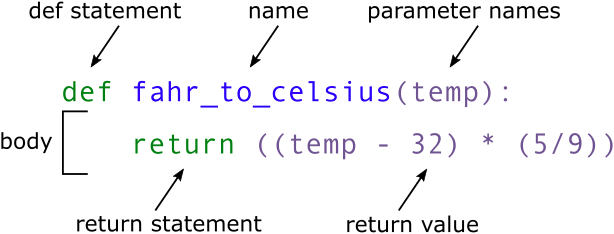

# Introduction

## Aim of the class

At the end of this class, you will be able to:

- Use conditionals to make choices in your code
- Understand some major data structures in Python 
- Create simple functions
- Run command-line scripts with user input
- Understand and raise exceptions

# Making choices


In our last lesson, we discovered something suspicious was going on in our inflammation data by drawing some plots. How can we use Python to automatically recognize the different features we saw, and take a different action for each? In this lesson, we’ll learn how to write code that runs only when certain conditions are true.


## Conditionals 

Conditionals allows you to make decisions in your code based on certain conditions.

```{bash}
if something is true:
    do task a
otherwise:
    do task b
```


For example we can ask Python to take different actions, depending on a condition, with an `if` statement:

```{python}
num = 37
if num > 100:
    print('greater')
else:
    print('not greater')
print('done')
```

If the test that follows the `if` statement is true, the body of the `if` (i.e., the set of lines indented underneath it) is executed, and "greater" is printed. If the test is false, the body of the `else` is executed instead, and "not greater" is printed. Only one or the other is ever executed before continuing on with program execution to print "done".

{#fig-interactive width=60%}

Conditional statements don't have to include an `else`. If there isn't one, Python simply does nothing if the test is false:

```{python}
num = 53
print('before conditional...')
if num > 100:
    print(num, 'is greater than 100')
print('...after conditional')
```

## Comaparison and membership operators

Here we used a comparison operator (`>`) to compare the value of `num` to `100`. 
Here are other comparison operators:

| Operator  | Name  |
|--------|--------|
| `==`  | Equal |
| `!=`  | Not equal |
| `>`  | Greater than |
| `>=`  | Greater than or equal to |
| `<`  | Less than |
| `<=`  | Less than or equal to |


```{python}
# Example
2 == 1 + 1
```

::: {.callout-note} 
Note that to test for equality we use a double equals sign `==` rather than a single equals sign `=` which is used to assign values.
::: 

::: {.callout-warning} 
You should never use equalty operators (`==`or `!=`) with floats or complex values.

```{python}
# Example
2.1 + 3.2 == 5.3
```

This is a floating point arithmetic problem seen in other programming languages. It is due to the difficulty of having a fixed number of binary digits (bits) to accurately represent some decimal number. This leads to small rounding errors in calculations.

```{python}
2.1 + 3.2 
```

If you need to use equalty operators, do it with a degree of freedom: 

```{python}
tol = 1e-6 ; abs((2.1 + 3.2) - 5.3) < tol
```
:::

The result of a comparison operator is a boolean value (`True` or `False`), which can be used in an `if` statement to control the flow of the program.

Booleans represent one of two values: `True` or `False`.
When you compare two values, the expression is evaluated and Python returns the Boolean answer:
```{python}
num = 37
print(num > 100)
```

There are also membership operators (`in` and `not in`). They are used to test if a value is present in a sequence (like a list or a string):


| Operator  | Description  |
|--------|--------|
| `in`  | Returns True if a sequence with the specified value is present in the object |
| `not in`  | Returns True if a sequence with the specified value is not present in the object |

```{python}
seq = ['ATGAAGGGTCCAAAA', 'AGTCCCCGTATGAT', 'ACCT', 'ACCT']

print('ACCT' in seq)
print('G' in seq[-1])
```

## `elif` statements

We can also chain several tests together using `elif` which is short for "else if".
The `elif` keyword is Python's way of saying "if the previous conditions were not true, then try this condition". 
The following Python code uses `elif` to print the sign of a number.

```{python}
num = -3

if num > 0:
    print(num, 'is positive')
elif num == 0:
    print(num, 'is zero')
else:
    print(num, 'is negative')
```

We can also combine tests using logical operators `and`, `or` and `not` to create more complex conditions.

## Logical operators

Logical operators are used to combine conditional statements:

| Operator  | Description  |
|--------|--------|
| `and`  | Returns True if both statements are true |
| `or`  | Returns True if one of the statements is true |
| `not`  | Reverse the result, returns False if the result is true |


Result of the `and` oeprator:

| Boolean 1  | Boolean 2  | Result | 
|--------|--------|
| `True`  | `True`  | `True` | 
| `True`   | `False` | `False`  | 
| `False`   | `True` | `False`  | 
| `False`   | `False` | `False`  | 

```{python}
# Example 
False and False, False and True, True and False, True and True
```


Result of the `or` oeprator:

| Boolean 1  | Boolean 2  | Result | 
|--------|--------|
| `True`  | `True`  | `True` | 
| `True`   | `False` | `True`  | 
| `False`   | `True` | `True`  | 
| `False`   | `False` | `False`  | 

```{python}
# Example 
False or False, False or True, True or False, True or True
```

```{python}
# Example 
True or not True
```

```{python}
if (1 > 0) and (-1 >= 0):
    print('both parts are true')
else:
    print('at least one part is false')
```

```{python}
if (1 < 0) or (1 >= 0):
    print('at least one test is true')
```

## Checking our data

Now that we’ve seen how conditionals work, we can use them to check for the suspicious features we saw in our inflammation data. 

From the first couple of plots, we saw that maximum daily inflammation exhibits a strange behavior and raises one unit a day. Wouldn’t it be a good idea to detect such behavior and report it as suspicious? Let’s do that! However, instead of checking every single day of the study, let’s merely check if maximum inflammation in the beginning (day 0) and in the middle (day 20) of the study are equal to the corresponding day numbers.

```{python}
import pandas as pd

data = pd.read_csv('data/inflammation-01.csv', index_col=0)

max_inflammation_0 = data.max(axis=0).iloc[0]
max_inflammation_20 = data.max(axis=0).iloc[20]

if max_inflammation_0 == 0 and max_inflammation_20 == 20:
    print('Suspicious looking maxima!')
```

We also saw a different problem in the third dataset; the minima per day were all zero (looks like a healthy person snuck into our study). And if neither of these conditions are true, we can use else to give the all-clear:

```{python}
data = pd.read_csv('data/inflammation-01.csv', index_col=0)

max_inflammation_0 = data.max(axis=0).iloc[0]
max_inflammation_20 = data.max(axis=0).iloc[20]

if max_inflammation_0 == 0 and max_inflammation_20 == 20:
    print('Suspicious looking maxima!')
elif data.min(axis=0).sum() == 0:
    print('Minima add up to zero!')
else:
    print('Seems OK!')
```

With another dataset:

```{python}
data = pd.read_csv('data/inflammation-03.csv', index_col=0)

max_inflammation_0 = data.max(axis=0).iloc[0]
max_inflammation_20 = data.max(axis=0).iloc[20]

if max_inflammation_0 == 0 and max_inflammation_20 == 20:
    print('Suspicious looking maxima!')
elif data.min(axis=0).sum() == 0:
    print('Minima add up to zero!')
else:
    print('Seems OK!')
```

In this way, we have asked Python to do something different depending on the condition of our data. Here we printed messages in all cases, but we could also imagine not using the else catch-all so that messages are only printed when something is wrong, freeing us from having to manually examine every plot for features we’ve seen before.

## Exercise

::: {.callout-important title="Exercise"} 

With `gene1_expression` and `gene2_expression` given, are these 2 codes equivalent? 

```{python}
#| eval: false

# Code A
if gene1_expression > gene2_expression:
  print("Gene 1 has higher expression level.")
elif gene1_expression < gene2_expression:
  print("Gene 2 has higher expression level.")
else:
  print("Gene 1 and Gene 2 have the same expression level.")
```
```{python}
#| eval: false

# Code B
if gene1_expression > gene2_expression:
  print("Gene 1 has higher expression level.")
else:
  if gene1_expression < gene2_expression:
    print("Gene 2 has higher expression level.")
  else:
    print("Gene 1 and Gene 2 have the same expression level.")
```

:::

::: {.content-hidden unless-meta="solutions"}

::: {.callout collapse="true" title="Solutions"}

Yes! Both codes will produce the same output for any given values of `gene1_expression` and `gene2_expression`. The first code uses `elif` to handle the second condition, while the second code uses a nested `if` statement. However, both structures will evaluate the conditions in the same way and yield the same results.

Understand better with an example: 
```{python}
gene1_expression = 100
gene2_expression = 50

# Code A
if gene1_expression > gene2_expression:
  print("Gene 1 has higher expression level.")
elif gene1_expression < gene2_expression:
  print("Gene 2 has higher expression level.")
else:
  print("Gene 1 and Gene 2 have the same expression level.")

# Code B
if gene1_expression > gene2_expression:
  print("Gene 1 has higher expression level.")
else:
  if gene1_expression < gene2_expression:
    print("Gene 2 has higher expression level.")
  else:
    print("Gene 1 and Gene 2 have the same expression level.")
```


```{python}
gene1_expression = 100
gene2_expression = 100

# Code A
if gene1_expression > gene2_expression:
  print("Gene 1 has higher expression level.")
elif gene1_expression < gene2_expression:
  print("Gene 2 has higher expression level.")
else:
  print("Gene 1 and Gene 2 have the same expression level.")

# Code B
if gene1_expression > gene2_expression:
  print("Gene 1 has higher expression level.")
else:
  if gene1_expression < gene2_expression:
    print("Gene 2 has higher expression level.")
  else:
    print("Gene 1 and Gene 2 have the same expression level.")
```

```{python}
gene1_expression = 50
gene2_expression = 100

# Code A
if gene1_expression > gene2_expression:
  print("Gene 1 has higher expression level.")
elif gene1_expression < gene2_expression:
  print("Gene 2 has higher expression level.")
else:
  print("Gene 1 and Gene 2 have the same expression level.")

# Code B
if gene1_expression > gene2_expression:
  print("Gene 1 has higher expression level.")
else:
  if gene1_expression < gene2_expression:
    print("Gene 2 has higher expression level.")
  else:
    print("Gene 1 and Gene 2 have the same expression level.")
```

:::
:::


::: {.callout-important title="Exercise"} 

Are these two codes equivalent? 

```{python}
#| eval: false
# Code A
if "ATG" in dna_sequence:
  print("Start codon found.")  
elif "TAG" in dna_sequence:
  print("Stop codon found.")  
else:
  print("No interesting codon found.") 
```

```{python}
#| eval: false
# Code B
if "ATG" in dna_sequence:
  print("Start codon found.")  
  if "TAG" in dna_sequence:
    print("Stop codon found.")  
else:
  print("No interesting codon found.") 
```


:::
::: {.content-hidden unless-meta="solutions"}

::: {.callout collapse="true" title="Solutions"}

Understand better with an example: 
```{python}
dna_sequence = "ATGCTAGCTAGCTAG"

# Code A
if "ATG" in dna_sequence:
  print("Start codon found.")  
elif "TAG" in dna_sequence:
  print("Stop codon found.")  
else:
  print("No interesting codon found.") 
```


```{python}
# Code B
if "ATG" in dna_sequence:
  print("Start codon found.")  
  if "TAG" in dna_sequence:
    print("Stop codon found.")  
else:
  print("No interesting codon found.") 
```

The equivalent code to `Code A` would be:

```{python}
if "ATG" in dna_sequence:
  print("Start codon found.")  
else:
  if "TAG" in dna_sequence:
    print("Stop codon found.")  
  else:
    print("No interesting codon found.") 
```

:::
:::


::: {.callout-important title="Exercise"} 

This code is incorrect, can you tell why?

```{python}
#| eval: false
x = 7

if x > 5:
  print("x is greater than 5")  
  if x > 10:
    print("x is greater than 10")  
  elif x = 10: 
    print("x equals 10") 
  else:
    print("x is less than 10")  
```

:::
::: {.content-hidden unless-meta="solutions"}

::: {.callout collapse="true" title="Solutions"}

```{python}
#| error: false
x = 7

if x > 5:
  print("x is greater than 5")  
  if x > 10:
    print("x is greater than 10")  
  elif x == 10: 
    print("x equals 10") 
    # It must be ==, the comparison operator 
    # instead of =, the assignement operator
  else:
    print("x is less than 10")  

```

:::
:::


::: {.callout-important title="Exercise"} 

Instead of just printing if a file falls into one or the other category, we want to save in lists the name of the files that have suspicious maximum trend, a suspicious minimum trend and the ones that seem normal at the moment.

Modify the following code: 

```{python}
data = pd.read_csv('data/inflammation-03.csv', index_col=0)

max_inflammation_0 = data.max(axis=0).iloc[0]
max_inflammation_20 = data.max(axis=0).iloc[20]

if max_inflammation_0 == 0 and max_inflammation_20 == 20:
    print('Suspicious looking maxima!')
elif data.min(axis=0).sum() == 0:
    print('Minima add up to zero!')
else:
    print('Seems OK!')
```

You will need to loop through all the files in the `data` folder, and create three lists `maxima_suspicious_files`, `minima_suspicious_files` and `normal_files` to save the names of the files that fall into each category.

Remember to make use of the function `list.append(element)` to add an element to a list.

:::

::: {.content-hidden unless-meta="solutions"}

::: {.callout collapse="true" title="Solutions"}


```{python}
import glob
import pandas as pd
import matplotlib.pyplot as plt

filenames = sorted(glob.glob('data/inflammation*.csv'))

maxima_suspicious_files = []
minima_suspicious_files = []
normal_files = []

for filename in filenames:
    data = pd.read_csv(filename, index_col=0)
    max_inflammation_0 = data.max(axis=0).iloc[0]
    max_inflammation_20 = data.max(axis=0).iloc[20]
    if max_inflammation_0 == 0 and max_inflammation_20 == 20:
        maxima_suspicious_files.append(filename)
    elif data.min(axis=0).sum() == 0:
        minima_suspicious_files.append(filename)
    else:
        normal_files.append(filename)

print("maxima_suspicious_files", maxima_suspicious_files)
print("minima_suspicious_files", minima_suspicious_files)
print("normal_files", normal_files)
```

:::
:::

# Storing multiple values in dictionaries

In the last exercise, we created three lists to store the names of the files that have suspicious maximum trend, a suspicious minimum trend and the ones that seem normal at the moment. We could also have stored this information in a dictionary, which is a data structure that allows us to store `key: value` pairs.

A dictionary is a collection which is ordered (as of Python >= 3.7), changeable and does not allow duplicates keys.
Dictionaries are written with curly brackets `{}`, with keys and values. Keys must be unique and of an immutable type (like strings or numbers), while values can be of any type (like strings, numbers, lists, dictionnaries...) and can be duplicated.

```{python}
organism1_genes = {
  #key: value;
  'BRCA1': 'DNA repair', 
  'TP53': 'Tumor suppressor', 
  'EGFR': 'Cell growth', 
  'MYC': 'Regulation of gene expression'
}
```


Dictionary items can be referred to by using the key name.
```{python}
organism1_genes["BRCA1"]
```

Dictionaries have specific methods. Here are a few: 

| Method  | Description  |
|--------|--------|
| `.items()` |  Returns a list containing a tuple for each key value pair | 
| `.keys()` | Returns a list containing the dictionary's keys |
| `.values()` | Returns a list of all the values in the dictionary |
| `.pop()` | Removes the element with the specified key |
| `.get()` | Returns the value of the specified key |

::: {.callout-important title="Exercise"} 

Modify the previous code so that instead of having 3 lists `maxima_suspicious_files`, `minima_suspicious_files` and `normal_files` you have only one dictionnary, called `classify_files`.
The values of the dictionary should be a list containing the name of the files, and the keys should be one of the following strings: `"suspicious maxima"`, `"suspicious minima"` or `"normal"`.

You can initialize the dictionnary like so:
```{python}
categorize_files = {
    "suspicious maxima": [],
    "suspicious minima": [],
    "normal": []
}
```

:::

::: {.content-hidden unless-meta="solutions"}

::: {.callout collapse="true" title="Solutions"}


```{python}
import glob
import pandas as pd
import matplotlib.pyplot as plt

filenames = sorted(glob.glob('data/inflammation*.csv'))

categorize_files = {
    "suspicious maxima": [],
    "suspicious minima": [],
    "normal": []
}

for filename in filenames:
    data = pd.read_csv(filename, index_col=0)
    max_inflammation_0 = data.max(axis=0).iloc[0]
    max_inflammation_20 = data.max(axis=0).iloc[20]
    if max_inflammation_0 == 0 and max_inflammation_20 == 20:
        categorize_files["suspicious maxima"].append(filename)
    elif data.min(axis=0).sum() == 0:
        categorize_files["suspicious minima"].append(filename)
    else:
        categorize_files["normal"].append(filename)

print("maxima_suspicious_files", categorize_files["suspicious maxima"])
print("minima_suspicious_files", categorize_files["suspicious minima"])
print("normal_files", categorize_files["normal"])
```

:::
:::


::: {.callout-important title="Exercise"} 

From the dictionary `organism1_genes` created as example, get the value of the key `BRCA1`. If the key does not exist, return `Unknown` by default. 
Try your code before **and after** removing the `BRCA1` key:value pair. 

Check the help of `get` by running `help(dict.get)`. 


:::
::: {.content-hidden unless-meta="solutions"}

::: {.callout collapse="true" title="Solutions"}

```{python}
organism1_genes
```
```{python}
organism1_genes.get('BRCA1', 'Unknown')
```
```{python}
organism1_genes.pop('BRCA1')
```
```{python}
organism1_genes
```
```{python}
organism1_genes.get('BRCA1', 'Unknown')
```
::: 
:::


# Creating functions

We have created a workflow to check if our data looks suspicious. In python we can wrap this workflow into a function, which is a reusable block of code that performs a specific task.
Functions allow us to organize our code and make it more modular and easier to read. 

For example, instead of reading a whole block of code, we could create a function called `check_suspicious_data()` that takes a filename as input and returns whether the data in the file is suspicious or not. But first let's learn how to create a function in Python.

::: {.callout-tip} 

A function usually takes some data as input (parameters that are required or optional), and usually returns an output (that can be of any type).

We already learned how to run a predefined function in the last lesson. 
You need to write its name followed by parenthesis. Parameters are added inside the parenthesis as follow:

```{python}
# round(number, ndigits=None)
x = round(number = 5.76543, ndigits = 2)
print(x)
```

To get more information about a function, use the `help()` function.

We will now learn how to create our own function. 
:::

Imagine that we want to convert a temperature in Fahrenheit and converting it to Celsius.
We could write:

```{python}
fahrenheit_val = 99
celsius_val = ((fahrenheit_val - 32) * (5/9))
```

and for a second number we could just copy the line and rename the variables:
```{python}
fahrenheit_val = 99
celsius_val = ((fahrenheit_val - 32) * (5/9))

fahrenheit_val2 = 43
celsius_val2 = ((fahrenheit_val2 - 32) * (5/9))
```

But we would be in trouble as soon as we had to do this more than a couple times. Cutting and pasting it is going to make our code get very long and very repetitive, very quickly. We’d like a way to package our code so that it is easier to reuse, a shorthand way of re-executing longer pieces of code. This is what functions are for. 

## Syntax

In python, a function is declared with the keyword `def` followed by its name, and the arguments inside parenthesis. 
The next block of code, corresponding to the content of the function, must be indented. The output is defined by the `return` keyword.

```{python}
def explicit_fahr_to_celsius(temp):
    # Assign the converted value to a variable
    converted = ((temp - 32) * (5/9))
    # Return the value of the new variable
    return converted
    
def fahr_to_celsius(temp):
    # Return converted value more efficiently using the return
    # function without creating a new variable. This code does
    # the same thing as the previous function but it is more explicit
    # in explaining how the return command works.
    return ((temp - 32) * (5/9))
```

{#fig-interactive width=70%}

When we call the function, the values we pass to it are assigned to those variables so that we can use them inside the function. Inside the function, we use a return statement to send a result back to whoever asked for it. Let’s try running our function:

```{python}
converted_temp = fahr_to_celsius(32)
print(converted_temp)

# or even,
print('freezing point of water:', fahr_to_celsius(32), 'C')
print('boiling point of water:', fahr_to_celsius(212), 'C')
```

We’ve successfully called the function that we defined, and we have access to the value that we returned.

## Documentation

You can also add a description of the function directly after the function definition. It is the message that will be shown when running `help()`. As it can be along text over multiple lines, it is common to put it inside triple quotes ```"""```. 

```{python}
def fahr_to_celsius(temp, inverted = False):
    """Returns the temperature in Celsius given a temperature in Fahrenheit, 
    or the inverse (Celsius to Fahrenheit) if inversted is True.
    Parameters:
    temp (float): Temperature in Fahrenheit.
    inverted (bool, optional): Whether to convert from Celsius to Fahrenheit (True) or Fahrenheit to Celsius (False).
    """
    return ((temp - 32) * (5/9))

help(fahr_to_celsius)
```

## Arguments

You can have several arguments. They can be mandatory or optional. To make them optional, they need to have a default value assigned inside the function definition, like so:

```{python}
def fahr_to_celsius(temp, inverted = False):
    """Returns the temperature in Celsius given a temperature in Fahrenheit, 
    or the inverse (Celsius to Fahrenheit) if inversted is True.
    Parameters:
    temp (float): Temperature in Fahrenheit.
    inverted (bool, optional): Whether to convert from Celsius to Fahrenheit (True) or Fahrenheit to Celsius (False).
    """
    if inverted:
        new_temp = ((temp * (9/5)) + 32)
    else:
        new_temp = ((temp - 32) * (5/9))
    return new_temp

# Or more efficiently:
def fahr_to_celsius(temp, inverted = False):
    """Returns the temperature in Celsius given a temperature in Fahrenheit, 
    or the inverse (Celsius to Fahrenheit) if inversted is True.
    Parameters:
    temp (float): Temperature in Fahrenheit.
    inverted (bool, optional): Whether to convert from Celsius to Fahrenheit (True) or Fahrenheit to Celsius (False).
    """
    if inverted:
        return ((temp * (9/5)) + 32)
    else:
        return ((temp - 32) * (5/9))

help(fahr_to_celsius)
```

::: {.callout-note} 
The `return` keyword is present twice, but the function will stop as soon as it reaches the first return statement, so if `inverted` is `True`, the second return statement will never be reached.
::: 

The input `temp` is mandatory but `inverted` is optional as it has a default value of `False`. If we call the function without providing a value for `inverted`, it will be set to `False` by default.

```{python}
fahr_to_celsius(32)
```

```{python}
#| error: true
fahr_to_celsius(inverted = True)
```

::: {.callout-note} 
Reminder: if you provide the parameters in the exact same order as they are defined, you don’t have to name them. If you name the parameters you can switch their order. As good practice, put all required parameters first.

```{python}
fahr_to_celsius(inverted = True, temp = 100)
```

```{python}
fahr_to_celsius(100, True)
```
:::

## Output

If no `return` statement is given, then no output will be returned, but the function will be run. 

```{python}
def fahr_to_celsius(temp, inverted = False):
    """Returns the temperature in Celsius given a temperature in Fahrenheit, 
    or the inverse (Celsius to Fahrenheit) if inversted is True.
    Parameters:
    temp (float): Temperature in Fahrenheit.
    inverted (bool, optional): Whether to convert from Celsius to Fahrenheit (True) or Fahrenheit to Celsius (False).
    """
    print("We are inside the function, the value of temp is:", temp)
    if inverted:
        new_temp = ((temp * (9/5)) + 32)
    else:
        new_temp = ((temp - 32) * (5/9))
```

```{python}
print(fahr_to_celsius(32))
```

The output can be of any type. If you have a lot of things to return, you might want to return a `list`. 

```{python}
def multiple_of_3(list_of_numbers):
  """Returns the number that are multiple of 3."""
  multiples = []
  for num in list_of_numbers:
    if num % 3 == 0: 
      # num % 3 == 0 means that the remainder 
      # of num divided by 3 is 0, 
      # which means that num is a multiple of 3
      multiples.append(num)
  return multiples

multiple_of_3(range(1, 20, 2))
```

::: {.callout-note} 
This could be written as a one-liner.
```{python}
def multiple_of_3(list_of_numbers):
  """Returns the number that are multiple of 3."""
  multiples = [num for num in list_of_numbers if num % 3 == 0]
  return multiples

multiple_of_3(range(1, 20, 2))
```
:::

## Variable Scope 

In composing our temperature conversion function, we sometimes created a variable inside of the function, `new_temp`. We refer to such variables as local variables because they no longer exist once the function is done executing. If we try to access their values outside of the function, we will encounter an error:

```{python}
#| error: true
print(new_temp)
```

If you want to reuse the converted temperature having calculated it with `fahr_to_celsius`, you can store the result of the function call in a variable:

```{python}
#| error: true
converted_temp = fahr_to_celsius(32)
print("Converted temp is:", converted_temp)
```

The variable `converted_temp`, being defined outside any function, is said to be global.

Interestingly, inside a function, one can read the value of such global variables:

```{python}
def print_temperatures():
    print('temperature in Fahrenheit was:', temp_fahr)
    print('temperature in Celsius was:', temp_celsius)

temp_fahr = 212.0
temp_celsius = fahr_to_celsius(212.0)

print_temperatures()
```

It is not recommended to modify the value of a global variable inside a function, as it can lead to unexpected behavior and make the code harder to debug. If you need to modify a global variable, it is better to return the modified value from the function and assign it to the global variable outside of the function.

## Application on our data

Now that we know how to wrap bits of code up in functions, we can make our inflammation analysis easier to read and easier to reuse. First, let’s make a `visualize()` function that generates our plots:

```{python}
import matplotlib.pyplot as plt
import pandas as pd
import numpy as np

def visualize(filename):
    """Visualizes the average, maximum and minimum inflammation per day for a given file.
    Parameters: 
    filename (str): The path of the file to visualize.
    """ 
    data = pd.read_csv(filename, index_col=0)
    fig = plt.figure()

    axes1 = fig.add_subplot(1, 3, 1)
    axes2 = fig.add_subplot(1, 3, 2)
    axes3 = fig.add_subplot(1, 3, 3)

    axes1.set_ylabel('average')
    axes1.set_xlabel('Days')
    axes1.set_xticks([])
    axes1.plot(data.mean(axis=0))

    axes2.set_ylabel('max')
    axes2.set_xlabel('Days')
    axes2.set_xticks([])
    axes2.plot(data.max(axis=0))

    axes3.set_ylabel('min')
    axes3.plot(data.min(axis=0))
    axes3.set_xlabel('Days')
    axes3.set_xticks([])

    fig.tight_layout()
    plt.show()

visualize("data/inflammation-01.csv")
```

We did not use the `return` keyword. In Python, functions are not required to include a `return` statement and can be used for the sole purpose of grouping together pieces of code that conceptually do one thing. In such cases, function names usually describe what they do, e.g. `visualize`. This is a common practice in Python, and it is not considered bad style. In fact, it can make the code more readable and easier to understand.


## Exercise 


::: {.callout-important title="Exercise"} 

Create a function that prints a message if the data in a file looks suspicious, using the same criteria as before (suspicious looking maxima and minima that add up to zero). No output needs to be returned, just print the message. It needs to also print the name of the file that is being checked.

Use it on one of the inflammation files, and then on all of them using a loop.

Add an optional parameter that asks the user to visulize the data if it has a suspicious maxima. If the parameter is set to `True`, the function should call the `visualize()` function we created earlier to show the mean, max and min plots of the data.

:::

::: {.content-hidden unless-meta="solutions"}

::: {.callout collapse="true" title="Solutions"}


```{python}
import pandas as pd
import glob

def detect_problems(filename, visualize_suspicious = False):
    """Checks if the data in a file has suspicious looking maxima and minima that add up to zero. 
    No output is returned, just a message is printed. 
    Parameters: 
    filename (str): The path of the file to visualize.
    """ 
    data = pd.read_csv(filename, index_col=0)
    print("Checking file:", filename)

    if data.max(axis=0).iloc[0] == 0 and data.max(axis=0).iloc[20] == 20:
        print('Suspicious looking maxima!')
        if visualize_suspicious:
            visualize(filename)
    elif data.min(axis=0).sum() == 0:
        print('Minima add up to zero!')
    else:
        print('Seems OK!')

detect_problems("data/inflammation-01.csv")
detect_problems("data/inflammation-01.csv", visualize_suspicious = True)
```

```{python}
filenames = sorted(glob.glob('data/inflammation*.csv'))
for filename in filenames:
    detect_problems(filename)
```


By giving our function human-readable names, we can more easily read and understand what is happening in the for loop. Even better, if at some later date we want to use either of those pieces of code again, we can do so in a single line.

Moreover, when writing code, it is important to keep in mind that other people (or even yourself in the future) will have to read and understand it. Therefore, it is good practice to write code that is easy to read and understand. This can be achieved by using descriptive variable and function names, adding comments to explain what the code is doing, and organizing the code in a logical way. 
Both documentation and a programmer’s coding style combine to determine how easy it is for others to read and understand the programmer’s code. 

:::
:::

# Command-Line programs

Sooner or later we will want to use our program in a pipeline or run it in a shell script to process thousands of data files. In order to do that in an efficient way, we need to make our programs work like other Unix command-line tools. For example, we may want a program that reads a dataset and prints the average inflammation per patient.

::: {.callout-tips} 
If you remember from the first lesson, it can be used either interactively in the terminal, or by writing a shell script (a file that contains shell commands) and running it. 
:::

::: {.callout-note} 
In this lesson we are switching from typing commands in a Python interpreter to typing commands in a shell terminal window (such as bash). When you see a `$` in front of a command that tells you to run that command in the shell rather than the Python interpreter.
:::

## Creating a python script

For this we need to create a Python script, which is a file that contains Python code. We can create a Python script using any text editor. The file should have a `.py` extension to indicate that it is a Python script.

Open a new file in your text editor, and write the following code:
```{python}  
#| eval: false 

#!/usr/bin/env python3

import pandas as pd

def main(filename, min = True, mean = True, max = True):
    data = pd.read_csv(filename, index_col=0)
    stats = {}

    if min:
        stats['min'] = data.min(axis=0).min()
    if mean:
        stats['mean'] = data.mean(axis=0).mean()
    if max:
        stats['max'] = data.max(axis=0).max()

    for key, value in stats.items():
        print(f"{key}: {value}")
```

Save it under the name `inflammation_stats.py`, in `~/Desktop/swc-python/code`.

:::{.callout-note}
F-strings are a way to format strings in Python. They are defined by prefixing a string with the letter `f` or `F`, and they allow you to include expressions inside curly braces `{}` that will be evaluated at runtime and included in the string.
They were introduced in Python 3.6 and provide a more concise and readable way to format strings. See the [official documentation](https://docs.python.org/3/tutorial/inputoutput.html) for more information on hwo to format strings.


:::

You should already be in the `~/Desktop/swc-python/` directory. If not you can navigate to it using the `cd` command in the terminal. Then, you can run the script using the following command:

```{bash}
cd ~/Desktop/swc-python
```

You can verify you are in the right directory by running `pwd` (print working directory):

```{bash}
pwd
```

You can now run the python script:

```{bash}
./code/inflammation_stats.py 
```

It should not output anything, as we only provided a function but did not call it. We need to call the `main()` function and provide it with the name of the file we want to analyze. We can do that by adding the following lines at the end of our script:

```{python}
#| eval: false 

if __name__ == "__main__":
    main("data/inflammation-01.csv")
```

This syntax is a common Python idiom that allows us to run the `main()` function when the script is executed directly from the command line. 
The `if` statement check if the script is being run as the main program or if it is being imported as a module in another script. If the script is being run directly, the code inside the `if` block will be executed. If it is being imported, the code inside the `if` block will not be executed.

Now, running `./code/inflammation_stats.py` in command line should output the average, minimum and maximum inflammation per patient for the file `data/inflammation-01.csv`.

:::{.callout-note}
Running a Python script in bash is very similar to importing that file in Python. The biggest difference is that we don’t expect anything to happen when we import a file, whereas when running a script, we expect to see some output printed to the console.

In order for a Python script to work as expected when imported or when run as a script, we typically put the part of the script that produces output in the following if statement:

```{python}
#| eval: false 

if __name__ == '__main__':
    main()  # Or whatever function produces output
```

When you import a Python file, `__name__` is the name of that file (e.g., when importing readings.py, `__name__` is `inflammation_stats`). However, when running a script in bash, `__name__` is always set to `__main__` in that script so that you can determine if the file is being imported or run as a script.
:::

## User-defined input

There are some interesting ways to get input from the user: 

- `input()` receives input from the keyboard. This means that the input is defined *while* the python script is being executed.
- `sys.argv` takes arguments provided in command line after the name of the program. This means that the input is defined *before* the python script is being executed.
- `argparse` is similar to `sys.argv`, with the advantage of being able to give specific names to arguments.


The `sys.argv` list contains the command-line arguments passed to the script, and `sys.argv[1]` refers to the first argument (the filename in this case).


### input

Python stops executing when it comes to the `input()` function, and continues when the user has given some input.

In the `inflammation_stats.py` file , write the following after the end of the `main()` function: 
```{python}
#| eval: False
filename = input("Enter filename: ")
print("Filename is: " + filename)

if __name__ == "__main__":
    main(filename)
```

Then in the terminal, run: 
```{bash}
./code/inflammation_stats.py 
```

You should be asked, in command line, to enter a filename. When you write it (e.g. `data/inflammation-01.csv`), and press Enter, it should run the `main()` function with the given file. 

```{bash}
Enter filename: data/inflammation-01.csv
Filename is: data/inflammation-01.csv
min: 0
mean: 6.14875
max: 20
```


### sys.argv

To use `sys.argv` you need to import a module called `sys`. It is part of the standard python library, so you should not have to install anything in particular. 

Modify the same python script, to add at the beginning of the script: 
```{python}
#| eval: False
import sys 
```

and substitute the end of the script with:
```{python}
#| eval: False

print("Filename is: " + sys.argv[1])

if __name__ == "__main__":
    main(sys.argv[1])
```

Then in the terminal, run: 
```{bash}
./code/inflammation_stats.py data/inflammation-01.csv
```

Arguments are given in command line, separated by `[space]`. 

```{bash}
Filename is: data/inflammation-01.csv
min: 0
mean: 6.14875
max: 20
```

::: {.callout-note} 
What is the type of `sys.argv`? Remember that in python index begins at `0`. What do you think is `sys.argv[0]`? Verify!

Also, what happens if you run `./code/inflammation_stats.py data/inflammation-01.csv data/inflammation-02.csv`? 
::: 


### argparse

Just like for `sys`, you need to import `argparse`. 

Modify the same python script, to add at the beginning of the script: 
```{python}
#| eval: False
import argparse 
```

and substitute the end of the script with:
```{python}
#| eval: False
parser = argparse.ArgumentParser()
parser.add_argument('--filename', action="store", required=True)
args = parser.parse_args()
print("Filename is: " + args.filename)

if __name__ == "__main__":
    main(args.filename)
```

Then in the terminal, run: 

```{bash}
./code/inflammation_stats.py --filename data/inflammation-01.csv
```

Arguments are given in command line, but they have specific names. 

::: {.callout-note} 
`argparse` is a very useful module when creating programs! You can easily specify the expected type of argument, whether  it is optional or not, and create a help for your script.
Check their [tutorial](https://docs.python.org/3/howto/argparse.html) for more information.
::: 


## Exercise

::: {.callout-important title="Exercise"} 

Modify the script to also take `--min`, `--mean` and `--max` as command line arguments. If the argument is given, the corresponding statistic will be calculated and printed. By default, it should not calculate any of the statistics, the user has to specify that in command line. 

If the user runs `./code/inflammation_stats_argparse.py --filename data/inflammation-01.csv --min --max`, it should only calculate and print the minimum and maximum inflammation per patient, but not the mean.

You can use the `action="store_true"` option in `add_argument()` to create a boolean variable for each statistic.  
For example:
```{python}
#| eval: false 
parser.add_argument('--min', action="store_true")
```

This line will create a variable called `args.min`, that will be set to `False` by default. When the user provides the `--min` argument in command line, `args.min` will be set to `True`. 

You should successfully run your script with the following commands:
```{bash}
./code/inflammation_stats.py --filename data/inflammation-01.csv --min
./code/inflammation_stats.py --filename data/inflammation-01.csv --max
./code/inflammation_stats.py --filename data/inflammation-01.csv --min --max
./code/inflammation_stats.py --filename data/inflammation-01.csv --min --max --mean
```

:::

::: {.content-hidden unless-meta="solutions"}

::: {.callout collapse="true" title="Solutions"}

```{python}
#| eval: false 
#!/usr/bin/env python3

import argparse
import pandas as pd

def main(filename, min = True, mean = True, max = True):
    data = pd.read_csv(filename, index_col=0)
    stats = {}

    if min:
        stats['min'] = data.min(axis=0).min()
    if mean:
        stats['mean'] = data.mean(axis=0).mean()
    if max:
        stats['max'] = data.max(axis=0).max()

    for key, value in stats.items():
        print(f"{key}: {value}")

# Deal with arguments
parser = argparse.ArgumentParser()
parser.add_argument('--filename', action="store", required=True)
parser.add_argument('--min', action="store_true")
parser.add_argument('--max', action="store_true")
parser.add_argument('--mean', action="store_true")
args = parser.parse_args()
print("Filename is: " + args.filename)

if __name__ == "__main__":
    main(args.filename, min=args.min, mean=args.mean, max=args.max)
```

Then in the command line, run:
```{bash}
./code/inflammation_stats.py --filename data/inflammation-01.csv --min
./code/inflammation_stats.py --filename data/inflammation-01.csv --max
./code/inflammation_stats.py --filename data/inflammation-01.csv --min --max
./code/inflammation_stats.py --filename data/inflammation-01.csv --min --max --mean
```

:::
:::


## Handle multiple filenames

The next step is to teach our program how to handle multiple files. 

We want our program to process each file separately, so we need a loop that executes once for each filename. If we specify the files on the command line, the filenames will be in `args.filename`. 
Fortunately, `argparse` has a built-in way to handle an unknown number of arguments. We can use the `nargs='+'` option in `add_argument()` to specify that we want to accept one or more filenames as input. This will create a list of filenames in `args.filename`, which we can then loop through.

Here's how it can be done:
```{python}
#| eval: false
#!/usr/bin/env python3

import argparse
import pandas as pd

def main(filename, min = True, mean = True, max = True):
    for file in filename:
        print("Processing file:", file)
        data = pd.read_csv(file, index_col=0)
        stats = {}

        if min:
            stats['min'] = data.min(axis=0).min()
        if mean:
            stats['mean'] = data.mean(axis=0).mean()
        if max:
            stats['max'] = data.max(axis=0).max()

        for key, value in stats.items():
            print(f"{key}: {value}")

# Deal with arguments
parser = argparse.ArgumentParser()
parser.add_argument('--filename', nargs='+', action="store", required=True)
parser.add_argument('--min', action="store_true")
parser.add_argument('--max', action="store_true")
parser.add_argument('--mean', action="store_true")
args = parser.parse_args()

if __name__ == "__main__":
    main(args.filename, min=args.min, mean=args.mean, max=args.max)
```

Then in command line, you can run:
```{bash}
./code/inflammation_stats.py --filename data/inflammation-01.csv --min --max
./code/inflammation_stats.py --filename data/inflammation-01.csv data/inflammation-02.csv --min --max
./code/inflammation_stats.py --filename data/inflammation-0*.csv --min --max
```

::: {.callout-note} 
What is the type of `args.filename` when using `nargs='+'`? What does it contain?
::: 

## Testing the code

When coding, a good practice is to test your code on small data files before running it on large datasets. This allows you to check that your code is working as expected and to catch any errors or bugs before they cause problems with larger datasets. 

Indeed, your code might not have any syntax errors, but it might not be doing what you think it is doing. For example, you might think that your code is calculating the mean of a dataset, but in reality, it is calculating the sum. If you run your code on a large dataset, you might not notice this error until it is too late.

Here we can test our code on a smaller file that has the same structure as the larger files, but only contains a few lines of data. This way, we can easily check that our code is calculating the mean correctly for each line, and that it is doing what we expect it to do.

The file `data/small-01.csv` contains the following data:
```{bash}
Day1,Day2,Day3
Patient1,0,0,1
Patient2,0,1,2
```

We can run: 
```{bash}
./code/inflammation_stats.py --filename data/small-01.csv --min --max --mean
```

There are two more files `small-02.csv` and `small-03.csv` that you can use to test your code.

It is also important to test your code on edge cases, which are cases that are at the extreme ends of the input space. For example, if your code is supposed to handle missing values, you should test it on a file that contains missing values to make sure that it is handling them correctly.

Even if your documentation is very clear, the user might not behave as you expect them to, and might provide input that is not in the format you expected. For example, if your code is supposed to take a filename as input, the user might provide a filename that does not exist, or a filename that is in a different format than what you expected. It is important to test your code on such edge cases to make sure that it is handling them correctly and providing useful error messages to the user.

# Errors and Exceptions

Every programmer encounters errors, both those who are just beginning, and those who have been programming for years. Encountering errors and exceptions can be very frustrating at times, and can make coding feel like a hopeless endeavour. However, understanding what the different types of errors are and when you are likely to encounter them can help a lot. Once you know why you get certain types of errors, they become much easier to fix.

## Tracebacks

Errors in Python have a very specific form, called a traceback. Let’s examine one by providing a filename that does not exist:

```{bash}
./code/inflammation_stats.py --filename data/small-06.csv --min --max --mean
```

```{bash}
Processing file: data/small-06.csv
Traceback (most recent call last):
  File "/Volumes/projects/PCa_SingleCell/utils/workshop/python-intro/./code/inflammation_stats.py", line 31, in <module>
    main(args.filename, min=args.min, mean=args.mean, max=args.max)
  File "/Volumes/projects/PCa_SingleCell/utils/workshop/python-intro/./code/inflammation_stats.py", line 9, in main
    data = pd.read_csv(file, index_col=0)
           ^^^^^^^^^^^^^^^^^^^^^^^^^^^^^^
  File "/Users/gilbartv/miniconda3/lib/python3.11/site-packages/pandas/io/parsers/readers.py", line 1026, in read_csv
    return _read(filepath_or_buffer, kwds)
           ^^^^^^^^^^^^^^^^^^^^^^^^^^^^^^^
  File "/Users/gilbartv/miniconda3/lib/python3.11/site-packages/pandas/io/parsers/readers.py", line 620, in _read
    parser = TextFileReader(filepath_or_buffer, **kwds)
             ^^^^^^^^^^^^^^^^^^^^^^^^^^^^^^^^^^^^^^^^^^
  File "/Users/gilbartv/miniconda3/lib/python3.11/site-packages/pandas/io/parsers/readers.py", line 1620, in __init__
    self._engine = self._make_engine(f, self.engine)
                   ^^^^^^^^^^^^^^^^^^^^^^^^^^^^^^^^^
  File "/Users/gilbartv/miniconda3/lib/python3.11/site-packages/pandas/io/parsers/readers.py", line 1880, in _make_engine
    self.handles = get_handle(
                   ^^^^^^^^^^^
  File "/Users/gilbartv/miniconda3/lib/python3.11/site-packages/pandas/io/common.py", line 873, in get_handle
    handle = open(
             ^^^^^
FileNotFoundError: [Errno 2] No such file or directory: 'data/small-06.csv'
```

Python tells us the category or type of error (in this case, it is an `FileNotFoundError`) and a more detailed error message (in this case, it says `[Errno 2] No such file or directory: 'data/small-06.csv'`).

This particular traceback has many levels. The traceback also shows us the exact line of code where the error occurred, and the sequence of function calls that led to that line of code being executed. 

The lines in our code that caused the error are `main(args.filename, min=args.min, mean=args.mean, max=args.max)`, and then `pd.read_csv(file, index_col=0)`. Indeed `main()` is the function that we called in command line, and inside `main()`, the error occurred when trying to read the file with `pd.read_csv()`. It gives more or the subsequent calls that were made inside the `pandas` library to get to the line of code that caused the error, but we can ignore those for now.
    
::: {.callout-note} 
The length of the error message does not reflect severity, rather, it indicates that your program called many subsequent functions before it encountered the error. 
:::

::: {.callout-tips} 
One reason for receiving this `FileNotFoundError` error is that you specified an incorrect path to the file. For example, if I am currently in a folder called `myproject`, and I have a file in `myproject/writing/myfile.txt`, but I try to open `myfile.txt`, this will fail. The correct path would be `writing/myfile.txt`. 

It is also possible that the file name or its path contains a typo.
:::

If you encounter an error and don’t know what it means, it is still important to read the traceback closely. That way, if you fix the error, but encounter a new one, you can tell that the error changed. Additionally, sometimes knowing where the error occurred is enough to fix it, even if you don’t entirely understand the message.

## Type of Exceptions

If you do encounter an error you don’t recognize, try looking at the official [documentation on errors](https://docs.python.org/3/library/exceptions.html) also called `Exceptions` in Python. However, note that you may not always be able to find the error there, as it is possible to create custom errors. In that case, hopefully the custom error message is informative enough to help you figure out what went wrong.

Here is a table of some of the built-in exceptions in python. 

| Exception  | Description  |
|--------|--------|
| `IndexError`  |  Raised when the index of a sequence is out of range.  |
| `KeyError`  |  Raised when a key is not found in a dictionary.  |
| `KeyboardInterrupt`  | Raised when the user hits the interrupt key (Ctrl+c or Delete). |
| `NameError`  |  Raised when a variable is not found in the local or global scope.  |
| `TypeError`  |  Raised when a function or operation is applied to an object of an incorrect type.  |
| `StatementError`  |  Raised when statements are in an order or contain characters not expected by the programming language.  |
| `ValueError`  |  Raised when a function receives an argument of the correct type but of an incorrect value.  |
| `RuntimeError`  |  Raised when an error occurs that do not belong to any specific exceptions.  |
| `Exception`  |  Base class of exceptions.  |

## Exercise

::: {.callout-important title="Exercise"} 

Try the following code and understand what the error is:

```{python}
#| error: true
# Code A
def print_message(day):
    messages = [
        'Hello, world!',
        'Today is Tuesday!',
        'It is the middle of the week.',
        'Today is Donnerstag in German!',
        'Last day of the week!',
        'Hooray for the weekend!',
        'Aw, the weekend is almost over.'
    ]
    print(messages[day])

def print_sunday_message():
    print_message(7)

print_sunday_message()
```
```{python}
#| error: true
# Code B
def some_function()
    msg = 'hello, world!'
    print(msg)
     return msg
```

```{python}
#| error: true
# Code C
def some_function():
	msg = 'hello, world!'
	print(msg)
        return msg
```

```{python}
#| error: true
# Code D
print(a)
```


```{python}
#| error: true
# Code E
for number in range(10):
    total = total + number
print('The count is:', count)
```

```{python}
#| error: true
# Code F
Count = 0
for number in range(10):
    count = count + number
print('The count is:', count)
```
:::

::: {.content-hidden unless-meta="solutions"}

::: {.callout collapse="true" title="Solutions"}

Code A raises an `IndexError` because it is trying to access the 8th element of the `messages` list, which only has 7 elements (indexed from 0 to 6), meaning we tried to access a list index that did not exist.

Code B raises a `SyntaxError` because there is a missing colon at the end of the function definition line (`def some_function()`). Additionally, there is an indentation error in the `return` statement, which should be indented to the same level as the `print` statement, raising an `IndentationError`.

Code C raises a `TabError` because there is a mix of tabs and spaces in the indentation. In Python, it is important to use either tabs or spaces consistently for indentation, but not both. This can be fixed by replacing all tabs with spaces or vice versa.

Code D raises a `NameError` because the variable `a` is not defined anywhere in the code. To fix this, you would need to define `a` before trying to print it, for example by assigning it a value like `a = 10`.
This can happend when you have a typo in the variable name, or when you forget to define a variable before using it, or when you wna tto print a string but forget to put the quotes around it. It is important to check that all variables are defined and spelled correctly before using them in your code.

:::
:::


# Defensive Programming


## Exceptions Handling

It is possible to handle errors (in python, they are also called exceptions), using the following statements:

- `try` to test a block of code for errors
- `except` to handle the error
- `else` to excute code if there is no error
- `finally` to excute code, regardless of the result of the try and except blocks

```{python}
# The try block will generate an exception, because some_undefined_variable is not defined:
try:
  print(some_undefined_variable)
except:
  print("Oops... Something went wrong") 
```

```{python}
#| error: true
# Without the try block, the program will crash and raise an error:
print(some_undefined_variable)
```

```{python}
try:
  print(some_undefined_variable)
except:
  print("Oops... Something went wrong") 
else:
  print("Nothing went wrong") 
finally:
  print("The 'try except' is finished") 
```

You can use the `Exceptions` types to be more specific about the type of exception occurring. 

```{python}
try:
  print(some_undefined_variable)
except NameError:
  print("A variable is not defined") 
except:
  print("Oops... Something went wrong") 
else:
  print("Nothing went wrong") 
finally:
  print("The 'try except' is finished") 
```

You can also use the `Exceptions` types to throw an exception if a condition occurs, by using the `raise` keyword.

```{python}
#| error: true
x = "hello"
try:
  if not isinstance(x, int):
    raise TypeError("Only integers are allowed") 
  if x < 0:
    raise ValueError("Sorry, no numbers below zero") 
  print(x, "is a positive integer.")
except NameError:
  print("A variable is not defined") 
else:
  print("Nothing went wrong") 
finally:
  print("The 'try except' is finished") 
```


## Exercise 

::: {.callout-important title="Exercise"} 

Let's make our previous function even better by adding some exception handling. Raise a `TypeError` if the input `filename` is not a string. To verify that a variable is of a certain type, you can use the `isinstance()` function. For example, `isinstance(x, str)` will return `True` if `x` is a string, and `False` otherwise.

With the input given below, the output and errors should be:
```{python}
#| eval: false

import pandas as pd

def main(filename, min = True, mean = True, max = True):
    print("Processing file:", filename)
    data = pd.read_csv(filename, index_col=0)
    stats = {}
    if min:
        stats['min'] = data.min(axis=0).min()
    if mean:
        stats['mean'] = data.mean(axis=0).mean()
    if max:
        stats['max'] = data.max(axis=0).max()
    for key, value in stats.items():
        print(f"{key}: {value}")

main(filename = 5474)
main(filename = "data/inflammation-01.csv")
```

```{python}
#| error: true
#| echo: false

import pandas as pd

def main(filename, min = True, mean = True, max = True):
    if not isinstance(filename, str):
        raise TypeError(f"Filename must be a string, {filename} is of type {type(filename)}")
    print("Processing file:", filename)
    data = pd.read_csv(filename, index_col=0)
    stats = {}
    if min:
        stats['min'] = data.min(axis=0).min()
    if mean:
        stats['mean'] = data.mean(axis=0).mean()
    if max:
        stats['max'] = data.max(axis=0).max()
    for key, value in stats.items():
        print(f"{key}: {value}")

main(filename = 5474)
main(filename = "data/inflammation-01.csv")
```


:::
::: {.content-hidden unless-meta="solutions"}

::: {.callout collapse="true" title="Solutions"}

```{python}
#| error: true

import pandas as pd

def main(filename, min = True, mean = True, max = True):
    if not isinstance(filename, str):
        raise TypeError(f"Filename must be a string, {filename} is of type {type(filename)}")
    print("Processing file:", filename)
    data = pd.read_csv(filename, index_col=0)
    stats = {}
    if min:
        stats['min'] = data.min(axis=0).min()
    if mean:
        stats['mean'] = data.mean(axis=0).mean()
    if max:
        stats['max'] = data.max(axis=0).max()
    for key, value in stats.items():
        print(f"{key}: {value}")


main(filename = 5474)
main(filename = "data/inflammation-01.csv")
```
::: 
:::

# Debugging

## Know what the code is supposed to do

The first step in debugging something is to know what it’s supposed to do. “My program doesn’t work” isn’t good enough: in order to diagnose and fix problems, we need to be able to tell correct output from incorrect. If we can write a test case for the failing case — i.e., if we can assert that with these inputs, the function should produce that result — then we’re ready to start debugging. If we can’t, then we need to figure out how we’re going to know when we’ve fixed things.

But writing test cases for scientific software is frequently harder than writing test cases for commercial applications, because if we knew what the output of the scientific code was supposed to be, we wouldn’t be running the software: we’d be writing up our results and moving on to the next program. In practice, scientists tend to do the following:

- Test with simplified data. Before doing statistics on a real data set, we should try calculating statistics for a single record, for two identical records, for two records whose values are one step apart, or for some other case where we can calculate the right answer by hand.
- Test a simplified case. If our program is supposed to simulate magnetic eddies in rapidly-rotating blobs of supercooled helium, our first test should be a blob of helium that isn’t rotating, and isn’t being subjected to any external electromagnetic fields. Similarly, if we’re looking at the effects of climate change on speciation, our first test should hold temperature, precipitation, and other factors constant.
- Compare to an oracle. A test oracle is something whose results are trusted, such as experimental data, an older program, or a human expert. We use test oracles to determine if our new program produces the correct results. If we have a test oracle, we should store its output for particular cases so that we can compare it with our new results as often as we like without re-running that program.
- Check conservation laws. Mass, energy, and other quantities are conserved in physical systems, so they should be in programs as well. Similarly, if we are analyzing patient data, the number of records should either stay the same or decrease as we move from one analysis to the next (since we might throw away outliers or records with missing values). If “new” patients start appearing out of nowhere as we move through our pipeline, it’s probably a sign that something is wrong.
- Visualize. Data analysts frequently use simple visualizations to check both the science they’re doing and the correctness of their code. This should only be used for debugging as a last resort, though, since it’s very hard to compare two visualizations automatically.


## Make it Fail Everytime

We can only debug something when it fails, so the second step is always to find a test case that makes it fail every time. The “every time” part is important because few things are more frustrating than debugging an intermittent problem: if we have to call a function a dozen times to get a single failure, the odds are good that we’ll scroll past the failure when it actually occurs.

As part of this, it’s always important to check that our code is “plugged in”, i.e., that we’re actually exercising the problem that we think we are. Every programmer has spent hours chasing a bug, only to realize that they were actually calling their code on the wrong data set or with the wrong configuration parameters, or are using the wrong version of the software entirely. Mistakes like these are particularly likely to happen when we’re tired, frustrated, and up against a deadline, which is one of the reasons late-night (or overnight) coding sessions are almost never worthwhile.

## Make it Fail Fast

If it takes 20 minutes for the bug to surface, we can only do three experiments an hour. This means that we’ll get less data in more time and that we’re more likely to be distracted by other things as we wait for our program to fail, which means the time we are spending on the problem is less focused. It’s therefore critical to make it fail fast.

As well as making the program fail fast in time, we want to make it fail fast in space, i.e., we want to localize the failure to the smallest possible region of code:

- The smaller the gap between cause and effect, the easier the connection is to find. Many programmers therefore use a divide and conquer strategy to find bugs, i.e., if the output of a function is wrong, they check whether things are OK in the middle, then concentrate on either the first or second half, and so on.

- N things can interact in N! different ways, so every line of code that isn’t run as part of a test means more than one thing we don’t need to worry about.


## Change One Thing at a Time

Replacing random chunks of code is unlikely to do much good. (After all, if you got it wrong the first time, you’ll probably get it wrong the second and third as well.) Good programmers therefore change one thing at a time, for a reason. They are either trying to gather more information (“is the bug still there if we change the order of the loops?”) or test a fix (“can we make the bug go away by sorting our data before processing it?”).

Every time we make a change, however small, we should re-run our tests immediately, because the more things we change at once, the harder it is to know what’s responsible for what (those N! interactions again). And we should re-run all of our tests: more than half of fixes made to code introduce (or re-introduce) bugs, so re-running all of our tests tells us whether we have regressed.

## Keep Track of What You've Done

Good scientists keep track of what they’ve done so that they can reproduce their work, and so that they don’t waste time repeating the same experiments or running ones whose results won’t be interesting. Similarly, debugging works best when we keep track of what we’ve done and how well it worked. If we find ourselves asking, “Did left followed by right with an odd number of lines cause the crash? Or was it right followed by left? Or was I using an even number of lines?” then it’s time to step away from the computer, take a deep breath, and start working more systematically.

Records are particularly useful when the time comes to ask for help. People are more likely to listen to us when we can explain clearly what we did, and we’re better able to give them the information they need to be useful.

## Ask for help

And speaking of help: if we can’t find a bug in 10 minutes, we should be humble and ask for help. Explaining the problem to someone else is often useful, since hearing what we’re thinking helps us spot inconsistencies and hidden assumptions. If you don’t have someone nearby to share your problem description with, get a rubber duck!

Asking for help also helps alleviate confirmation bias. If we have just spent an hour writing a complicated program, we want it to work, so we’re likely to keep telling ourselves why it should, rather than searching for the reason it doesn’t. People who aren’t emotionally invested in the code can be more objective, which is why they’re often able to spot the simple mistakes we have overlooked.

Part of being humble is learning from our mistakes. Programmers tend to get the same things wrong over and over: either they don’t understand the language and libraries they’re working with, or their model of how things work is wrong. In either case, taking note of why the error occurred and checking for it next time quickly turns into not making the mistake at all.

If we train ourselves to avoid making some kinds of mistakes, to break our code into modular, testable chunks, and to turn every assumption (or mistake) into an assertion, it will actually take us less time to produce working programs, not more.


# Final tips and resources 

Here are a couple of tips:

- Leave comments (think of your future self)
- Be consistent (quotes, indents...)
- Break down one complex task into lots of (easy) small tasks
- When using functions you are not comfortable with, verify the output and make sure it does what you expect in with small examples
- Don't re-invent the wheel, for common tasks, it's likely that a function already exists
- Read the documentation when using a new package or function
- Google It! Use the correct programming vocabulary to increase your chances of finding an answer. If you don't find anything, try wording it differently. 
- Prompt it to AI! It works generally well to explain a code, and for small tasks using famous packages.
- The easiest way to learn is by example, so follow a tutorial with the example data, and then try to apply it to your own

You can follow some free tutorials on:

- [Code Academy](https://www.codecademy.com/catalog/language/python)
- [EdX](https://www.edx.org/learn/python)
- Youtube!
  

# References {.unnumbered}

Here are some references and ressources that greatly inspired this class : 

- [Python doc](https://docs.python.org/3/tutorial/introduction.html)
- [w3schools](https://www.w3schools.com/python/)
- [pythonforbiologists](https://www.pythonforbiologists.org/)
- [justinbois's Bootcamp](https://justinbois.github.io/bootcamp/2020/lessons/l01_welcome.html#.py-files)
- [Software carpentry 1](https://swcarpentry.github.io/python-novice-inflammation/)
- [Software carpentry 2](https://swcarpentry.github.io/python-novice-gapminder/)


